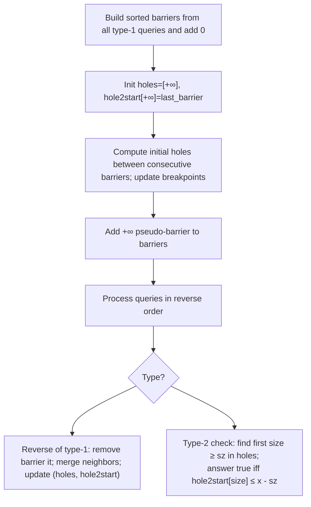

### Block Placement Queries — Without Segment Trees (SortedList approach)

This note explains a solution that answers the queries using `sortedcontainers.SortedList` and a clever reverse-processing idea, without building a segment tree.

### Problem restatement (brief)

- We place point obstacles (barriers) at given positions on the non-negative number line.
- For a check query [2, x, sz], we need to know if there exists a contiguous free interval (a “hole”) of length ≥ sz that lies entirely within [0, x]. Touching barriers is allowed.

### Key observation

For [2, x, sz], a block of size sz can fit in [0, x] iff there exists a hole of length ≥ sz whose start position s satisfies s ≤ x − sz. So, if we can quickly answer:

- “Among all holes of length ≥ L, what is the earliest start position?”
  then the query is a single comparison against x − L.

### Data structures

- `barriers`: a sorted list of barrier positions (we add 0 initially, and later a sentinel +∞).
- `holes`: a sorted list of “breakpoint sizes”. These are the thresholds of hole length at which the earliest-start function changes.
- `hole2start`: a mapping from each size in `holes` to the earliest start among all holes with length ≥ that size.

Think of `holes` + `hole2start` as a monotone staircase function f(L) = minimal start among holes with length ≥ L. We only keep the breakpoints where f changes; dominated points are removed.

### Visual: workflow



### Why reverse processing?

Forward, adding a barrier splits one hole into two smaller holes (a “split”), which complicates maintaining the staircase. Reversed, removing a barrier merges two holes into one larger hole (a “merge”), and merges are easy to reflect in a monotone structure.

### Forward preparation (one-time)

1. Scan all queries; insert every type-1 position into `barriers`. Also insert 0.
2. Sort `barriers` and compute initial holes between consecutive barriers (start, end): size = end − start.
   - For each size, if it improves the earliest start for threshold `size`, update the staircase: insert the size into `holes` (if needed), set `hole2start[size] = start`, and remove any dominated breakpoints to keep the structure minimal and monotone.
3. Add a sentinel barrier +∞ to simplify handling of the tail (from the last finite barrier to +∞). Seed `holes` with +∞ and set `hole2start[+∞] = last_finite_barrier`.

### Reverse processing of queries

- Reverse the original queries and process:
  - Type-1 in forward (add barrier) becomes remove barrier in reverse:
    - Let `left < it < right` be neighboring barriers (using `barriers.bisect_left(it)`). Removing `it` merges two holes into one: new hole size = `right − left`, new hole start = `left`.
    - Update the staircase: find position of `size` in `holes` (bisect). If current earliest start for that threshold is greater than `left`, we can improve it. While the previous breakpoint’s start is also greater than `left`, remove it (dominated). Set `hole2start[size] = left` and ensure `size` is present in `holes`.
    - Remove `it` from `barriers`.
  - Type-2 [2, x, sz] (check):
    - Find the first threshold size ≥ sz in `holes` via `bisect_left`.
    - Let that size be `S`; read `s_min = hole2start[S]`.
    - Answer is True iff `s_min ≤ x − sz`.

### Example: queries = [[1,2], [2,3,3], [2,3,1], [2,2,2]]

Forward prep:

- barriers initially: [0]; after scanning adds: [0, 2]
- holes: (0, 2) → size 2, start 0 → record threshold 2 with earliest start 0
- add +∞: barriers = [0, 2, +∞]
- `holes` = [2, +∞]; `hole2start[2] = 0`; `hole2start[+∞] = 2`

Reverse process:

1. [2,2,2]: sz=2, x=2 → first size ≥2 is 2 → s_min=0 → 0 ≤ 0 → True
2. [2,3,1]: sz=1, x=3 → first size ≥1 is 2 → s_min=0 → 0 ≤ 2 → True
3. [2,3,3]: sz=3, x=3 → first size ≥3 is +∞ → s_min=2 → 2 ≤ 0? → False
4. [1,2] (remove barrier 2): neighbors are 0 and +∞ → merged size +∞, start 0 → improves `hole2start[+∞]` from 2 to 0; remove dominated points if any.

Reverse-collected answers: [True, True, False]; reverse back to forward order: [False, True, True].

### Correctness intuition

- The staircase property: f(L) = earliest start among holes of length ≥ L is non-increasing as L decreases, and we store it as breakpoints in `holes` with their earliest starts in `hole2start`.
- Removing a barrier only creates a larger hole; this can only move the staircase “down” (earlier start) at the new size, potentially eliminating previously stored dominated points.
- A query [2, x, sz] simply asks if f(sz) ≤ x − sz.

### Complexity

- Each `SortedList` operation is O(log N).
- Each barrier is added once in prep and removed once in reverse; each dominated breakpoint is removed at most once. Total time is O(N log N) amortized.

### Reference implementation (for clarity)

```python
from typing import List
from sortedcontainers import SortedList


class Solution:
    def getResults(self, queries: List[List[int]]) -> List[bool]:
        barriers = SortedList()
        barriers.add(0)

        # Collect all barriers first
        for t, *rest in queries:
            if t == 1:
                x = rest[0]
                barriers.add(x)

        holes = SortedList()
        holes.add(float('inf'))
        hole2start = {float('inf'): barriers[-1]}

        # Build initial staircase from consecutive gaps
        for i in range(len(barriers) - 1):
            start = barriers[i]
            end = barriers[i + 1]
            size = end - start
            if size > 0:
                pos = holes.bisect_left(size)
                size_at_pos = holes[pos]
                if hole2start[size_at_pos] > start:
                    if size_at_pos > size:
                        holes.add(size)
                    hole2start[size] = start

        barriers.add(float('inf'))

        res = []
        for q in reversed(queries):
            if q[0] == 1:  # remove barrier (reverse of add)
                it = q[1]
                pos = barriers.bisect_left(it)
                left = barriers[pos - 1]
                right = barriers[pos + 1]
                size = right - left

                p = holes.bisect_left(size)
                if hole2start[holes[p]] > left:
                    while p > 0 and hole2start[holes[p - 1]] > left:
                        del hole2start[holes[p - 1]]
                        del holes[p - 1]
                        p -= 1
                    hole2start[size] = left
                    if holes[p] != size:
                        holes.add(size)

                barriers.remove(it)
            else:  # check
                _, x, sz = q
                p = holes.bisect_left(sz)
                size = holes[p]
                res.append(hole2start[size] <= x - sz)

        res.reverse()
        return res
```

### Tips

- Always seed with 0 and a +∞ sentinel to normalize the edges.
- Maintain the staircase by removing dominated breakpoints whenever a new larger hole provides an earlier start.
- For queries, reduce to a single binary search (size ≥ sz) and one comparison to x − sz.
