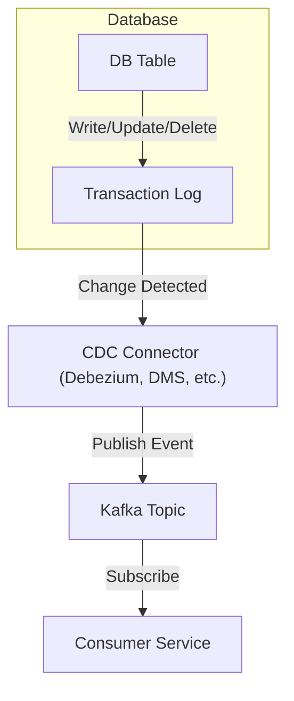

# Change Data Capture (CDC) Deep Dive

## 1. What is CDC and Why is it Needed?

Change Data Capture (CDC) is a mechanism to detect and capture changes (inserts, updates, deletes) made to data in a database. It enables real-time data replication, event-driven microservices, audit logging, and ETL pipelines. Instead of polling the entire database, CDC provides a stream of changes, making it efficient and scalable.

---

## 2. How Does CDC Work? (General Mechanisms)

CDC can be implemented in several ways, depending on the database:

### a. Database Triggers

- Custom triggers on tables log changes to a separate table or emit events.
- **Pros:** Simple, works on most RDBMS.
- **Cons:** Performance overhead, hard to maintain, not always atomic.

### b. Transaction Log (Write-Ahead Log) Mining

- Most modern databases write all changes to a transaction log (WAL, binlog, redo log).
- CDC tools read these logs to extract changes.
- **Pros:** Low overhead, captures all changes, atomic with DB commit.
- **Cons:** Requires access to internal logs, sometimes limited by DB vendor.

### c. Timestamp/Version Columns

- Applications query for rows with a timestamp/version greater than the last seen.
- **Pros:** Simple to implement.
- **Cons:** Can miss deletes, not truly real-time, not atomic.

### d. Change Tables (Shadow Tables)

- Some databases provide built-in change tables (e.g., SQL Server CDC).
- **Pros:** Supported natively, reliable.
- **Cons:** Vendor-specific.

---

## 3. Atomicity: How CDC Ensures Events Are Sent Atomically

- **Log-based CDC** (WAL/binlog mining) is atomic: the change is only visible in the CDC stream after the transaction commits.
- **Trigger-based CDC** can be atomic if the trigger writes to a change table in the same transaction.
- **Change tables** are updated as part of the transaction, ensuring atomicity.

**Key Point:**  
If CDC is based on the transaction log, the event is guaranteed to represent a committed change, and the event is generated atomically with the DB update.

---

## 4. Where Do CDC Events Go?

- **Messaging Queues:** Kafka, RabbitMQ, AWS Kinesis, Google Pub/Sub, etc.
- **Change Tables:** For polling by ETL jobs.
- **Direct Consumers:** Microservices, data lakes, analytics platforms.

**Typical Flow:**

1. CDC tool/connector reads changes from the DB (log, triggers, etc.).
2. CDC tool publishes events to a message broker (Kafka is most common).
3. Downstream consumers subscribe to the topic/queue and process events.

---

## 5. How to Configure CDC Event Consumption

- **CDC Connectors:** Tools like Debezium, AWS DMS, Striim, etc., connect to the DB, extract changes, and publish to a message queue.
- **Consumers:** Microservices, ETL jobs, or analytics systems subscribe to the queue/topic and process events.
- **Configuration:** Define which tables to monitor, how to serialize events (JSON, Avro, etc.), and where to publish.

---

## 6. CDC in Different Databases

### PostgreSQL

- **WAL-based CDC:** Tools like Debezium or AWS DMS read the Write-Ahead Log (WAL).
- **Logical Replication Slots:** PostgreSQL supports logical decoding for streaming changes.
- **Atomicity:** Changes are captured after commit.
- **Event Flow:** WAL → Debezium → Kafka → Consumers.

### MySQL

- **Binlog-based CDC:** MySQL’s binary log records all changes.
- **Tools:** Debezium, Maxwell’s Daemon, AWS DMS.
- **Atomicity:** Binlog is written after commit.
- **Event Flow:** Binlog → CDC tool → Kafka/Queue.

### MongoDB

- **Oplog-based CDC:** MongoDB’s replica set oplog records all changes.
- **Tools:** MongoDB Change Streams, Debezium.
- **Atomicity:** Oplog entries are written after commit.
- **Event Flow:** Oplog → Change Stream → Kafka/Queue.

### Cassandra

- **CDC Tables:** Cassandra 4.x+ supports CDC by writing changes to a commit log directory.
- **Tools:** Cassandra CDC, Striim, custom log readers.
- **Atomicity:** CDC log is written after commit.
- **Event Flow:** CDC log → CDC tool → Kafka/Queue.

### DynamoDB

- **Streams-based CDC:** DynamoDB Streams capture changes to items.
- **Atomicity:** Stream records are available after the transaction.
- **Event Flow:** DynamoDB Stream → Lambda/Kinesis → Consumers.

---

## 7. Example: CDC Flow with Kafka

---

## 8. Summary Table

| Database   | CDC Mechanism        | Atomicity | CDC Tooling       | Event Destination     |
| ---------- | -------------------- | --------- | ----------------- | --------------------- |
| PostgreSQL | WAL/Logical Decoding | Yes       | Debezium, DMS     | Kafka, Kinesis, etc.  |
| MySQL      | Binlog               | Yes       | Debezium, Maxwell | Kafka, Kinesis, etc.  |
| MongoDB    | Oplog/Change Streams | Yes       | Debezium, Native  | Kafka, Kinesis, etc.  |
| Cassandra  | CDC Commit Log       | Yes       | Striim, Custom    | Kafka, Kinesis, etc.  |
| DynamoDB   | Streams              | Yes       | Native, Lambda    | Kinesis, Lambda, etc. |

---

## 9. Best Practices

- Use log-based CDC for atomicity and reliability.
- Use a robust message broker (Kafka is industry standard).
- Ensure idempotency in consumers (events may be delivered more than once).
- Monitor lag and failures in the CDC pipeline.
- Secure access to logs and message brokers.

---

Would you like a more detailed example for a specific database, or a sample configuration for a CDC tool like Debezium?
