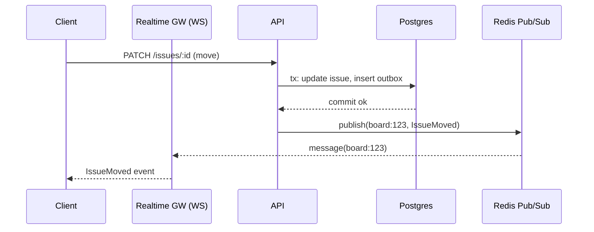

# Collaborative Board — Deep Dives

This document adds **three deep dives** to the Jira‑like board design:
1) Moving items (user flow + data modeling)  
2) Real‑time board updates (WebSocket + Redis pub/sub)  
3) Conflict handling for items (issues) on a board

For each topic we outline **≥2 approaches**, **pros/cons**, and **why we prefer** one for the MVP and how to **evolve** it.

---

## 1) Moving Items on a Board (User Flow & Data Modeling)

### User Flow (Drag & Drop)
1. **User drags** an issue to a new position (within same column or across columns).  
2. **Client shows optimistic UI**: temporarily reorders the list locally.  
3. **Client sends** a `MOVE` request with: `issueId`, `fromColumnId`, `toColumnId`, `beforeIssueId?`, `afterIssueId?`, `clientProvisionalRank?`, and **Idempotency-Key**.  
4. **Server computes canonical order** and **persists** the move in a single transaction:
   - Validates permissions and WIP limits.
   - Computes a **new rank key** based on neighbors in the destination column.
   - Updates `issue.status_col_id`, `issue.rank_key`, increments `issue.version`.
   - Appends an `audit_event` and emits an **IssueMoved** domain event to the bus.
5. **Server responds** with the authoritative `rank_key`, `version`, and new `status_col_id`.
6. **Client reconciles**: if optimistic rank differs, it snaps to server value.
7. **Other clients** see a real‑time update (see Deep Dive #2).

### Data Model Fields Involved
- `issues.status_col_id` — target column/status.  
- `issues.rank_key` — **lexicographic order key** within column (or integer position depending on approach).  
- `issues.version` — optimistic concurrency control.  
- `audit_events` — append‑only log of moves.  
- Optional: `issues.last_moved_at`, `issues.moved_by` for analytics/audit.

---

### Approach A — **Integer Positions**

**Idea:** Each issue keeps an integer `position` within the column. Reordering updates many rows (shift positions).

**How it works**
- When moving, compute target integer and **shift** intervening rows up/down.
- Enforce `(status_col_id, position)` uniqueness.

**Pros**
- Easy to reason about and debug.
- Natural SQL ordering (`ORDER BY position`).
- Simple to implement for very small lists.

**Cons**
- **O(n) writes** on reorder; hot columns suffer under concurrency.
- High write amplification → vacuum pressure in Postgres.
- Conflicts frequent when multiple users reorder simultaneously.
- Requires careful gap management or periodic reindexing.

**When it fits**
- Small boards (< few hundred issues/column) with low concurrency.

---

### Approach B — **Lexicographic Rank Keys (Fractional Indexing)** ✅ *Preferred*

**Idea:** Store an ordered **string key** (`rank_key`, e.g., base‑62) for each issue. To insert between two keys, compute a **midpoint key** → **no mass shifts**.

**How it works**
- Each column has a set of `rank_key`s that are lexicographically sortable.
- On move:
  - Find neighbors (`beforeIssueId`, `afterIssueId`).
  - Compute a key strictly between their keys (e.g., `mid(left, right)`).
  - If at head/tail, use `decrement(right)` or `increment(left)`.
- Occasional **rebalancing** when keys get dense (background job only touches that column).

**Pros**
- Reorders are **O(1)** average: only the moved row updates.
- Great under concurrency; collisions are rare and resolvable with retries.
- Smooth drag‑drop UX even under load.

**Cons**
- More complex key math and periodic rebalancing.
- Keys are opaque (harder to debug by hand than integers).

**Why preferred**
- Best latency & write profile for collaborative boards.
- Keeps OLTP workload small; scales to tens of millions of issues with partitioning.

**Notes**
- Use unique constraint `(board_id, rank_key)` to detect rare collisions → recompute.
- Consider fixed‑width keys (e.g., 8–16 chars in base‑62).

---

### Approach C — **Linked‑List Pointers (next_id)**

**Idea:** Each issue points to its `next_issue_id` in a column (singly‑linked list).

**Pros**
- Localized updates (change a handful of pointers).
- Intuitive to insert/remove.

**Cons**
- Fetching ordered lists requires walking the list or maintaining a **materialized order**.
- Failure recovery is complex (broken chains).
- Concurrency still tricky (pointer races).

**When it fits**
- Niche cases with very frequent single-item insert/removal but rare full scans (not typical for boards).

---

### Server Transaction (Approach B example — Postgres)

```
BEGIN;
-- 1) Load neighbors with FOR UPDATE SKIP LOCKED to avoid blocking
-- 2) Compute new_rank = mid(left.rank_key, right.rank_key)
-- 3) Update issue (and column if changed), increment version
-- 4) Insert audit_event + outbox row
COMMIT;
-- After commit, publish IssueMoved(eventId) to realtime channel
```

**API shape**

```
POST /issues/{id}/move
Headers: Idempotency-Key: <uuid>, If-Match: "<version>"
Body: { toColumnId, beforeIssueId?, afterIssueId?, clientRankHint? }
→ 200 { issueId, toColumnId, rankKey, version, movedAt, movedBy }
```

**Edge Cases & Errors**
- WIP limit exceeded → `409` with actionable message.
- Neighbors changed concurrently → server recomputes; if still collides, retry once then `409` with hint to refresh.
- Move to archived column/board → `403` or `404` depending on visibility.

---

## 2) Real‑Time Board Updates (WebSocket + Redis)

### Event Model

- **Event types**: `IssueCreated`, `IssueUpdated`, `IssueMoved`, `IssueDeleted`, `CommentAdded`, `ColumnUpdated`, etc.
- **Envelope**: `{eventId, orgId, boardId, aggregateType, aggregateId, version, ts, actor, payload}`
- **Ordering key**: `(aggregateId)`; clients merge by `version` per aggregate.

### Client Subscription

- Connect `wss://rt.example.com/connect?token=...`
- Subscribe to channels: `board:{boardId}` (summary), `issue:{issueId}` (detail).
- Receive **snapshots** on first subscribe and **deltas** afterwards.
- Heartbeats (ping/pong), exponential backoff, resume with `lastEventId` if supported.

---

### Approach 1 — **Redis Pub/Sub Fanout (Ephemeral)** ✅ *Preferred for MVP*

**How it works**
- API service commits transaction → writes an **outbox** row → a worker publishes to Redis channel `board:{id}` with the event payload.
- All **Realtime Gateway** nodes subscribe (pattern `board:*`). Each node fans out events to its connected WebSocket clients that are subscribed to that board.



**Pros**
- **Lowest latency** (sub‑ms broker + WS push).
- Simple operations; no per-connection state beyond subscriptions.
- Scales well to **tens of thousands** of concurrent sockets per region.

**Cons**
- **At‑most‑once** delivery; no persistence/backfill.
- If a client disconnects during an event, it may miss it → must refresh state on reconnect.
- Cross‑region ordering requires care (prefer single writer per board or route writes by shard).

**Why preferred**
- Matches interactive board needs (humans, not trading systems).  
- Simplicity wins; missed events are corrected by **fetch‑on‑reconnect** (cheap).

**Hardening**
- Send **coalesced** updates (e.g., multiple field changes collapsed).
- Rate limit fanout per board; drop/combine noisy events.
- Include **current `version`** so clients can detect stale local state.

---

### Approach 2 — **Durable Streams (Redis Streams / Kafka) + Fanout**

**How it works**
- Instead of ephemeral pub/sub, publish events to a **durable stream** (Kafka topic `board-{shard}` or Redis Stream).  
- Realtime Gateway consumes streams, maintains **offsets**, and fans out to sockets. On reconnect with `sinceEventId`, the gateway **replays** missed events.

**Pros**
- **At‑least‑once** delivery; supports **backfill** on reconnect.
- Event history enables diagnostics and **time travel** replays.
- Cleaner cross‑service integration (search, notifications, analytics) from the same stream.

**Cons**
- Higher **latency** and **complexity**: offset tracking, compaction, rebalancing.
- Per‑connection replay can be expensive; requires batching/windowing.
- More infra (Kafka/ZooKeeper or Redis Streams scalers), ops burden.

**When to choose**
- Regulatory or audit environments needing guaranteed delivery.
- Very large orgs with **heavy automation** reacting to every event.

---

### Approach 3 — **Managed Realtime (Ably/Pusher/SignalR)**

**Pros**: Offloads the WS complexity, cross‑region presence, guaranteed fanout SLAs.  
**Cons**: Vendor lock‑in, cost, and limits on message shape/size.

---

### Security & Presence

- Auth via **JWT** (scoped to `orgId` & allowed `boardIds`), validated at connect & on subscribe.
- **Presence**: store `presence:board:{id}` as a Redis **SET** keyed by `userId` with TTL heartbeat (~20–30s).  
- **Typing indicators**: ephemeral keys `typing:issue:{id}:{userId}` with low TTL (3–5s).

### Backpressure & Coalescing

- If a client is slow, **drop** older non-critical events and send a **“resync recommended”** hint.
- Combine bursty events (e.g., 20 inline edits → one `IssueUpdated` with a patch).

### Observability

- Metrics: WS connections, subscribe/unsubscribe rates, p95 fanout latency, Redis egress, dropped events, publish errors.
- Tracing: include `correlationId` from HTTP write → outbox → publish → WS send.
- Logs: channel name, message size, recipients, success/fail counts.

---

## 3) Conflict Handling for Issues on a Board

Conflicts appear when multiple users **edit the same issue** or **reorder/move** it concurrently.

### Conflict Types
- **Field edits** (title, priority, assignee, labels, custom fields)
- **Rich text** edits (description, comments are append‑only)
- **Moves/Reorders** (column and relative position)
- **Delete vs Edit** (tombstone vs update)

---

### Approach 1 — **Optimistic Concurrency Control (OCC) with Versioning** ✅ *Preferred Baseline*

**How it works**
- Each issue has a `version` (int).  
- Clients send `If-Match: "<version>"` on `PATCH`/`MOVE`.
- Server updates only if versions match; increments version on success.
- On mismatch → `409 Conflict` with **server copy** (and optional diff hints).

**Pros**
- No server locks; high throughput, simple to scale.
- Fits HTTP well (ETags/If-Match).
- Works great with **idempotency keys** for retries.

**Cons**
- Clients must **reconcile** when conflicts occur.
- Naïve “last write wins” may clobber fields unintentionally.

**Preferred with enhancements**
- **Field‑level merges** where safe: sets (labels, watchers) → **union**; numerics (story points) → last‑writer; assignee/priority → last‑writer with audit.
- **Server‑generated diffs** to help the UI merge non‑overlapping changes automatically.

---

### Approach 2 — **Pessimistic Locking (Row/Distributed Locks)**

**How it works**
- Acquire a lock before editing: DB `SELECT … FOR UPDATE` or Redis lock (`issue:{id}`) using Redlock pattern.
- Hold lock during edit; release on commit/timeout.

**Pros**
- Avoids conflicts entirely; users won’t clobber each other.
- Predictable semantics for critical workflows (e.g., release manager doing bulk changes).

**Cons**
- **Throughput drops** under contention; lock handoffs add latency.
- Risk of **deadlocks** or user-abandoned locks (need TTL & recovery UX).
- Poor offline support and degraded UX for casual edits.

**When to use**
- Admin operations, **bulk scripts**, or rare “exclusive edit mode” on critical artifacts.

---

### Approach 3 — **CRDT/OT for Rich Text + Hybrid for Fields**

**How it works**
- Use a **CRDT** (e.g., Y.js/Automerge) or **OT** for the **description** (document-like).  
- Keep **OCC** for structured fields; comments remain **append-only** (no conflict).

**Pros**
- Natural **co-editing** experience on long descriptions without conflicts.
- Offline edits merge automatically when clients reconnect.

**Cons**
- Client complexity and **state bloat** (need snapshots/GC).
- Harder to reason about server-side indexing/search of the doc without denormalization.

**When to choose**
- If collaborative authoring is a core differentiator (Confluence-like editing inline).

---

### Special Case — **Concurrent Reorders/Moves**

**Detection & Resolution (with rank keys)**
- Unique constraint `(board_id, rank_key)` ensures no two issues have the same spot.
- If two moves pick the same neighbor set, server may compute identical `rank_key`:
  - **On conflict**: recompute with refreshed neighbors and retry (bounded attempts).
  - If still colliding: respond `409` advising client to refresh column slice.
- Tie-breaking policy for **simultaneous moves**:
  - Order by **transaction commit time** (or Lamport clock), with **actorId** as tie-breaker.
  - Emit events in that order with monotonically increasing `version` per `issueId`.

**Delete vs Edit**
- Soft-delete issues with a tombstone (`deleted_at`).  
- Edits after delete → `410 Gone` with pointer to restore flow; deletes after edit → allowed but audit shows causality.

---

### Why We Prefer OCC + Rank Keys (and CRDT for docs when needed)

- **OCC** gives best **throughput** with minimal server coordination; simple to explain and operate.
- **Rank keys** localize reorder writes and gracefully handle concurrency with retries.
- **CRDT for rich text** is opt‑in and isolated to the description field, avoiding whole‑system complexity.

---

## Implementation Nuggets (Copy‑ready)

### Move Operation (OCC + Rank Keys) — Pseudocode

```python
def move_issue(issue_id, to_col_id, before_id=None, after_id=None,
               if_match_version=None, actor_id=None, idem_key=None):
    begin_tx()
    issue = load_issue_for_update(issue_id)  # SELECT ... FOR UPDATE
    if issue.version != if_match_version:
        raise Conflict(with_server=issue)
    left = load_issue(before_id) if before_id else None
    right = load_issue(after_id) if after_id else None
    new_key = compute_mid_key(left.rank_key if left else None,
                              right.rank_key if right else None)
    # Update
    issue.status_col_id = to_col_id
    issue.rank_key = new_key
    issue.version += 1
    save(issue)
    insert_audit('IssueMoved', before=..., after=...)
    insert_outbox('IssueMoved', payload={...})
    commit_tx()
    publish_realtime('board:{id}', event('IssueMoved', ...))
    return issue
```

### WebSocket Message Envelope

```json
{
  "eventId": "01JABCDXYZ",
  "type": "IssueMoved",
  "orgId": 42,
  "boardId": 123,
  "aggregateId": 98765,
  "version": 18,
  "ts": "2025-08-24T12:10:45.120Z",
  "actor": {"id": 7, "name": "Asha"},
  "payload": {
    "issueId": 98765,
    "fromColumnId": 111,
    "toColumnId": 222,
    "rankKey": "mQ3xP0aa",
    "beforeIssueId": 777,
    "afterIssueId": 888
  }
}
```

### Realtime Gateway — Subscription Flow (Auth + Join)

```mermaid
sequenceDiagram
  participant C as Client
  participant G as Realtime GW
  participant A as Auth/JWT
  C->>G: WS Connect ?token=JWT
  G->>A: Validate JWT (org, boards)
  A-->>G: OK (claims)
  C->>G: SUBSCRIBE board:123
  G-->>C: SNAPSHOT board:123 (columns, top N issues)
  G-->>C: DELTA IssueMoved/Updated...
  Note over G: Publish/subscribe via Redis; fanout to all subscribers of board:123
```

### Redis Channels & Presence Keys

- Publish channels: `board:{boardId}`, `issue:{issueId}`  
- Presence: `SET presence:board:{boardId} userId TTL=30s` (refresh heartbeat)  
- Typing: `SET typing:issue:{issueId}:{userId} TTL=3s`

### Client Reconnect Strategy

- On reconnect, **fetch board slice** (`GET /boards/{id}?sinceVersion=X`) to fill gaps.  
- If durable streams are adopted, reconnect with `sinceEventId` and replay deltas.

---

## Pros/Cons Summary Tables

### Moves (Ordering)
| Approach | Latency | Write Amp | Concurrency | Complexity | Preferred? |
|---|---|---:|---:|---:|---|
| Integer positions | Low for small lists | **High** | Poor | Low | No |
| Rank keys | **Low** | **Low** | Good (retry) | Medium | **Yes** |
| Linked list | Medium | Low | Medium | High | No |

### Realtime
| Approach | Delivery | Latency | Complexity | Backfill | Cost | Preferred? |
|---|---|---|---|---|---|---|
| Redis Pub/Sub | At‑most‑once | **Very low** | Low | No | Low | **Yes (MVP)** |
| Durable Streams | At‑least‑once | Medium | High | **Yes** | Medium/High | Later |
| Managed Realtime | Varies | Low | Low (vendor) | Varies | $$ | Maybe |

### Conflicts
| Approach | Throughput | UX | Complexity | Guarantees | Preferred? |
|---|---|---|---|---|---|
| OCC + field merges | **High** | Good (auto-merge simple cases) | Low/Med | Detects conflicts | **Yes** |
| Pessimistic locks | Low under contention | Clear | Medium | Avoids conflicts | Sometimes |
| CRDT/OT (docs) | Med | **Great** for co-edit | High | Convergent | For descriptions |

---

## Why These Preferences (MVP → Scale)

- **Rank keys + OCC** deliver a **snappy** UX and scale operationally with minimal moving parts.
- **Redis Pub/Sub** makes realtime **fast and simple**. If/when missed-events become a real UX problem, we can **upgrade** the channel from pub/sub to **durable streams** without redesigning producers/consumers (the event envelope remains stable).
- **CRDT only where it shines** (rich text). Everything else stays simple and auditable.

---

## Operational Notes

- **Idempotency**: All `POST`/`MOVE` operations accept `Idempotency-Key`; store in Redis with the response for 24h.  
- **Fanout limits**: Cap per-board outbound QPS; if exceeded, send **“board busy, resync soon”** banner and throttle.  
- **Schema hygiene**: Keep `(board_id, status_col_id, rank_key)` covered indexes; reindex during low-traffic windows.  
- **Rebalance scheduler**: Nightly job scans columns with dense key ranges and rekeys in batches (100–500 rows/tx).  
- **Observability**: SLO on **fanout latency p95 < 150 ms** and **update propagation < 300 ms** across nodes.

---

## Test Scenarios You Can Mention in Interviews

- **Concurrent drag-drops**: 100 users moving items within one column — ensure no deadlocks; verify retries occur ≤2x.  
- **Gateway restart**: Drop 10% of WS connections mid‑move; clients reconnect, fetch snapshot, and converge.  
- **Outbox lag**: Inject 2 min delay in event publisher — check “index catching up” banner and that UI still functions.  
- **Rebalance**: Force a dense key range; verify background rekey does not reorder items unexpectedly and maintains stability.

---

*End of deep dives.*
