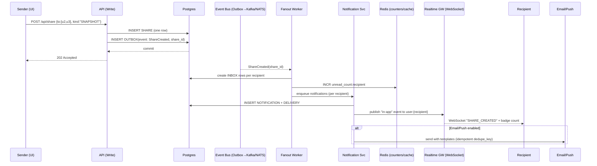
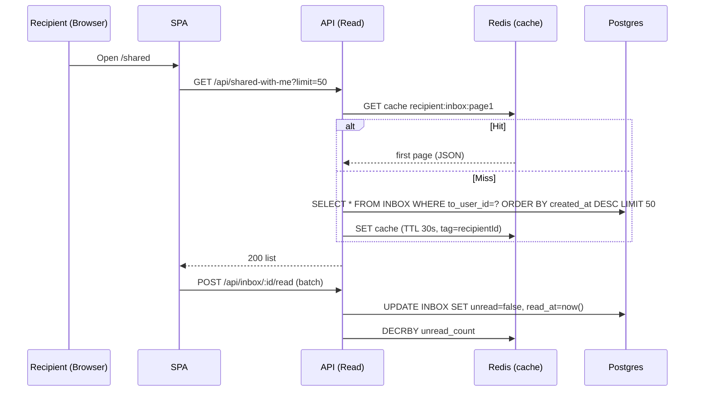

# “Shared With Me” + Notifications — Design & Scaling (Color Picker)

This document extends the **Favorite Color Picker** system with a **Shared With Me** list and **notifications** when someone shares a color with you. It covers **data modeling changes**, **APIs**, **real‑time updates**, and **scaling considerations** up to millions of users.

---

## 1) Problem Framing & Requirements

### Functional
- Sender selects one or more recipients and **shares** their favorite color.
- Recipients see a **Shared With Me** list showing:
  - Color, sender, when shared, optional note.
  - Status (new/unread/read, revoked/expired).
- Recipient gets a **notification** (in‑app; optional email/push).
- Share can be **revoked** by sender; recipients no longer see it.
- Optional: share to **non‑users by email** (invitation claimed on sign‑up).

### Non‑functional
- **Scalable** to tens of millions of users; peak **hundreds of shares/second**.
- **Low latency** list fetch (p95 < 200ms near data).
- **At‑least‑once** notification delivery; **idempotent** producers/consumers.
- **Privacy/abuse controls**: rate‑limit senders; block list; opt‑out channels.

---

## 2) Data Modeling Changes

We add **share edges** (sender → recipient) and **notifications**. For multi‑recipient shares at scale, we avoid array blobs and store **one row per recipient**.

```mermaid
erDiagram
  USER ||--o{ FAVORITE : has
  USER ||--o{ SHARE : sends
  USER ||--o{ INBOX : receives
  SHARE ||--o{ INBOX : fanout
  SHARE ||--o{ NOTIFICATION : triggers
  NOTIFICATION ||--o{ DELIVERY : per-channel

  USER {
    uuid id PK
    text email unique
    text display_name
    timestamptz created_at
  }

  FAVORITE {
    uuid user_id PK FK
    text color_hex
    text color_space
    text color_value
    timestamptz updated_at
  }

  SHARE {
    uuid id PK
    uuid from_user_id FK
    text share_kind "SNAPSHOT|LIVE"
    text color_hex "if SNAPSHOT"
    uuid favorite_ref "if LIVE -> favorites.user_id"
    text note
    timestamptz created_at
    timestamptz expires_at nullable
    text status "ACTIVE|REVOKED|EXPIRED"
  }

  INBOX {
    uuid id PK
    uuid share_id FK
    uuid to_user_id FK
    boolean unread
    timestamptz created_at
    timestamptz read_at nullable
    text visibility "VISIBLE|HIDDEN|REVOKED"
  }

  NOTIFICATION {
    uuid id PK
    uuid recipient_user_id FK
    uuid share_id FK
    text type "SHARE_CREATED|SHARE_REVOKED"
    jsonb payload
    timestamptz created_at
    timestamptz read_at nullable
    text status "NEW|SENT|READ"
    text dedupe_key unique nullable
  }

  DELIVERY {
    uuid id PK
    uuid notification_id FK
    text channel "IN_APP|EMAIL|PUSH"
    text provider_id nullable
    text status "QUEUED|SENT|FAILED"
    int attempts
    timestamptz updated_at
  }

  USER_PREF {
    uuid user_id PK FK
    boolean email_enabled
    boolean push_enabled
    boolean inapp_enabled default true
    jsonb quiet_hours nullable
  }

  BLOCK {
    uuid blocker_user_id FK
    uuid blocked_user_id FK
    PRIMARY KEY (blocker_user_id, blocked_user_id)
  }

  INVITE {
    uuid id PK
    uuid share_id FK
    text email_index "lower(email) or hashed"
    timestamptz created_at
    timestamptz expires_at
    text status "PENDING|CLAIMED|EXPIRED|CANCELLED"
  }
```

**Indexes & Partitioning**
- `INBOX(to_user_id, created_at DESC)` **covering** `(share_id, unread, visibility)` → powers “Shared With Me” page.  
- `SHARE(from_user_id, created_at DESC)` for sender history & revocation.  
- `NOTIFICATION(recipient_user_id, created_at DESC)` for bell icon & unread count.  
- **Partitions** (hash or range) on `INBOX` by `to_user_id` when rows > ~100M.  
- **Optional** partial index on `INBOX(to_user_id) WHERE unread = true` for fast badge counts.

**Why separate `SHARE` and `INBOX`?**  
- `SHARE` is the **event** (one row per share action).  
- `INBOX` is the **fanout** per recipient enabling fast per‑user queries and revocation visibility.  
- For 1:1 shares, `INBOX` is still useful for unread/read state and partitioning by recipient.


---

## 3) API Surface

- `POST /api/share`
  ```json
  { "to": ["userId|email", "..."], "kind": "SNAPSHOT|LIVE", "note": "optional" }
  ```
  → 202 Accepted (fanout async)

- `GET /api/shared-with-me?cursor=<ts,id>&limit=50`  
  → List of `INBOX` entries with `{color, sender, note, createdAt, status, shareId}`

- `POST /api/inbox/:id/read` (idempotent)  
- `DELETE /api/share/:shareId` (revoke) → marks `SHARE.status=REVOKED`, `INBOX.visibility=REVOKED`, `NOTIFICATION` of type `SHARE_REVOKED`
- `POST /api/block` to mute a sender

**Notes**
- Use **cursor-based pagination** `(created_at, id)` for stable paging.  
- **Idempotency-Key** on POST share to avoid duplicate fanouts on retry.


---

## 4) End‑to‑End Flow (Preferred Architecture)

### Share Creation → Fanout → Notifications



### “Shared With Me” Page Load



---

## 5) Scaling Considerations

### 5.1 Throughput & Storage
- If 10M users with 2 shares/day average, **20M shares/day**:  
  - **Writes**: 1 `SHARE` row + N `INBOX` rows (N recipients). For 1:1, this is **~20M** `INBOX` rows/day.  
  - **Reads**: “Shared With Me” is top‑N per user; cache **page‑1** in Redis.  
- **Partition `INBOX`** by hash(`to_user_id`) into 16–64 partitions (Postgres native partitioning).  
- Maintain **hot partition** monitoring; rebalance if skew exists (heavy recipients).

### 5.2 Queries & Indexes
- Primary list query: `WHERE to_user_id = ? AND visibility='VISIBLE' ORDER BY created_at DESC LIMIT ?`  
  - Composite index `(to_user_id, visibility, created_at DESC) INCLUDE(share_id, unread)` (or partial index on visibility=VISIBLE).  
- Badge count: store in `Redis` (`unread_count:{userId}`) with periodic reconcile from DB to correct drift.

### 5.3 Eventing & Idempotency
- Use **outbox pattern** on `SHARE` write to guarantee exactly‑once publication to BUS.  
- `Fanout Worker` idempotency: unique key `(share_id, to_user_id)` when inserting `INBOX`.  
- Notification dedupe: `dedupe_key = share_id:recipient:SHARE_CREATED` to avoid duplicate sends on retries.

### 5.4 Realtime
- WebSocket channel `user:{userId}`; publish small payloads (ids + minimal fields).  
- For massive fanout (e.g., sender to many recipients), **batch** publishes and pace them to avoid WS storm.  
- **Backpressure**: if a client is slow, send “resync” hint; rely on GET to reconcile.

### 5.5 Caching
- **Page‑1 cache** per recipient (50 rows) in Redis with 30–60s TTL.  
- **Invalidate** on new `INBOX` insert or revocation (tagged keys).  
- Keep **deep pages** uncached; rely on DB with cursor paging.

### 5.6 Multi‑Region
- Start with **single write region** (DB primary) + **global CDN**.  
- Add **read replicas** close to recipients for `GET /shared-with-me`. Post‑write reads (sender view) hit **primary** to ensure read‑your‑write.  
- If global writes required, migrate to **multi‑region database** (e.g., Cockroach/Spanner) or app‑level **home‑region per user**:  
  - Route share writes to **recipient’s home region** (determined via `user.home_region`).  
  - Cross‑region fanout uses regional workers; notifications sent locally.

### 5.7 Abuse & Privacy
- **Rate limit** `POST /share` per sender/IP (token bucket with Redis) and per‑recipient (e.g., ≤ X/day).  
- **Block list** table to prevent unwanted shares; enforce at fanout time.  
- **Opt‑out** channel preferences in `USER_PREF`.  
- **PII minimization**: if sharing by email, store **normalized hash** for invites; reveal only on claim.

### 5.8 Consistency & Revocation
- Revocation flow updates `SHARE.status` and marks `INBOX.visibility='REVOKED'`.  
- Emit `SHARE_REVOKED` event → in‑app badge decrement if unread.  
- Cache purge: delete recipient’s page‑1 cache and any **edge‑cached** share pages tied to this share (if public slugs coexist).

### 5.9 Observability
- Metrics: share creations/s, fanout lag, inbox insert latency, WS fanout p95, unread count drift, notification success rate.  
- Logs: structured with `share_id`, `recipient_id`, `dedupe_key`.  
- Tracing: Share API → DB (outbox) → BUS → Fanout → Notification → WS push.

---

## 6) Notification Delivery Options

### Option A — **In‑App + Optional Email/Push via Notification Service** ✅ *Preferred*
- In‑app is authoritative (always on).  
- Email/Push are **best‑effort** with retry/backoff; provider webhooks update delivery status.

**Pros:** Unified event → multiple channels, clean retries.  
**Cons:** Operates a service/queue; provider integrations needed.

### Option B — **Edge Triggers (serverless background functions)**
- Emit directly from API to provider asynchronously.

**Pros:** Minimal infra.  
**Cons:** Harder idempotency/observability at scale; vendor lock‑in sprinkled across code.

### Option C — **Managed Pub/Sub + Workerless Patterns** (e.g., Cloudflare Queues + Durable Objects)
- Reduce ops; good for serverless shops.

**Pros:** Easy to scale; low ops.  
**Cons:** Vendor lock‑in; feature gaps.

---

## 7) “Shared With Me” Modeling Approaches (Trade‑offs)

### Approach 1 — **Direct 1:1 Share Rows (INBOX = SHARE for single recipient)**
- Merge `INBOX` into `SHARE` by adding `to_user_id`.  
**Pros:** Simpler schema for 1:1.  
**Cons:** Hard to extend to **multi‑recipient**; unread/read state tied to share (one recipient only).

### Approach 2 — **Share + Inbox Fanout (Recommended)**
- `SHARE` (one per share action) + `INBOX` (one per recipient).  
**Pros:** Scales to multi‑recipient; clean per‑recipient state; easy partitioning by `to_user_id`.  
**Cons:** Extra table; need fanout worker (or DB trigger cautiously).

### Approach 3 — **On‑Read Join (No Fanout)**
- Store `SHARE` with array of recipients; compute “Shared With Me” by scanning & filtering.  
**Pros:** Few writes.  
**Cons:** **Terrible read performance** at scale; bad indexability; revocation per recipient is hard.

**Preferred:** **Approach 2** for performance, flexibility, and clean ownership of recipient state.

---

## 8) Pros & Cons vs Public Slug Sharing

**Benefits of “Shared With Me” + Notifications**
- **Discoverability**: recipients have a **central list**; no need to keep links.  
- **Privacy/Control**: targeted delivery, **revocation** affects recipients immediately.  
- **Engagement**: in‑app + push/email notifications; unread badge drives retention.  
- **Abuse controls**: rate limits, block lists, per‑recipient visibility.

**Trade‑offs/Costs**
- Requires **user accounts/directory** (or invite flow).  
- **More writes** (fanout rows) and **more infra** (notifications, Redis, bus).  
- **PII** concerns when sharing by email; compliance & preference handling.  
- Extra complexity in **multi‑region** write routing.

**Hybrid Strategy:** Keep **public slugs** for viral, anonymous sharing **and** provide **targeted shares** for known users; both can coexist with clear UX and routes.

---

## 9) SQL & Index Examples

```sql
-- INBOX table (fanout per recipient)
CREATE TABLE inbox (
  id uuid PRIMARY KEY DEFAULT gen_random_uuid(),
  share_id uuid NOT NULL REFERENCES share(id) ON DELETE CASCADE,
  to_user_id uuid NOT NULL REFERENCES users(id) ON DELETE CASCADE,
  unread boolean NOT NULL DEFAULT true,
  visibility text NOT NULL CHECK (visibility IN ('VISIBLE','HIDDEN','REVOKED')) DEFAULT 'VISIBLE',
  created_at timestamptz NOT NULL DEFAULT now(),
  read_at timestamptz
);
CREATE INDEX idx_inbox_user_time ON inbox(to_user_id, created_at DESC);
CREATE INDEX idx_inbox_user_unread ON inbox(to_user_id) WHERE unread = true;

-- Notification dedupe
CREATE UNIQUE INDEX uq_notification_dedupe ON notification(dedupe_key) WHERE dedupe_key IS NOT NULL;

-- Block list
CREATE TABLE block (
  blocker_user_id uuid NOT NULL REFERENCES users(id),
  blocked_user_id uuid NOT NULL REFERENCES users(id),
  PRIMARY KEY (blocker_user_id, blocked_user_id)
);
```

---

## 10) Failure Modes & Mitigations

- **Fanout backlog** → increase consumer parallelism; scale partitions; apply backpressure to share API (return 202 + spinner in UI).  
- **Notification provider outage** → queue retries with exponential backoff; cap parallelism; surface “delayed” badge in-app.  
- **Unread counter drift** → periodic reconcile job compares Redis vs DB (`COUNT(*) WHERE unread and visible`).  
- **Hot recipient** (celebrity) → shard `inbox` by `to_user_id` hash; enable per-user cache; impose sender rate limits per recipient.

---

## 11) Metrics & SLOs

- **SLO**: p95 `GET /shared-with-me` < 200ms (near replica).  
- **SLO**: 99% notifications enqueued < 1s from share creation.  
- **KPIs**: Inbox open rate, unread to read conversion, notification deliverability.  
- **Infra**: BUS lag, fanout throughput, DB write/read QPS, replica lag.

---

## 12) Security & Privacy

- Enforce auth & **row‑level** filters by `user_id`.  
- Validate recipient identities; prevent sharing to self (unless allowed).  
- **Opt‑out** and **block** respected at fanout time; log decisions.  
- Minimize email storage; for invites store **hashed email** and show masked address until claimed.

---

## 13) Minimal UI/UX Notes

- **Shared With Me** tab: virtualized list, unread badge, mark‑all‑as‑read.  
- Sender flow: typeahead to find users; show “blocked” error if applicable.  
- Notification bell: WebSocket updates badge; offline fallback via polling (30–60s).

---

*End of document.*
