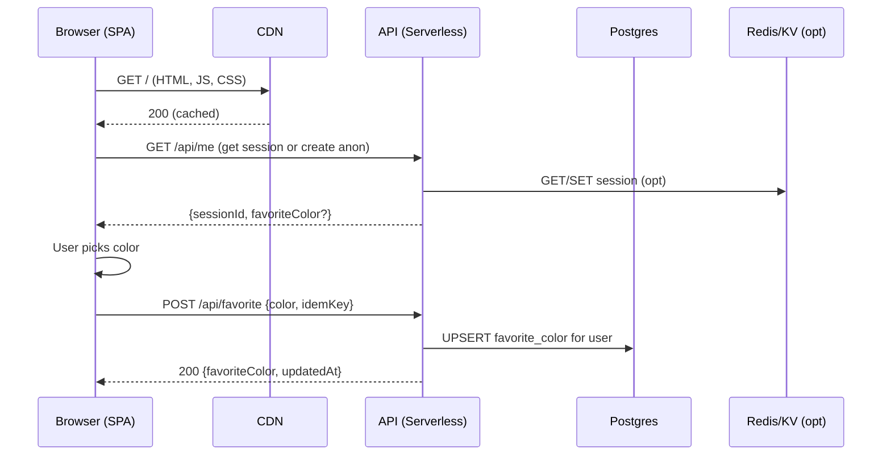
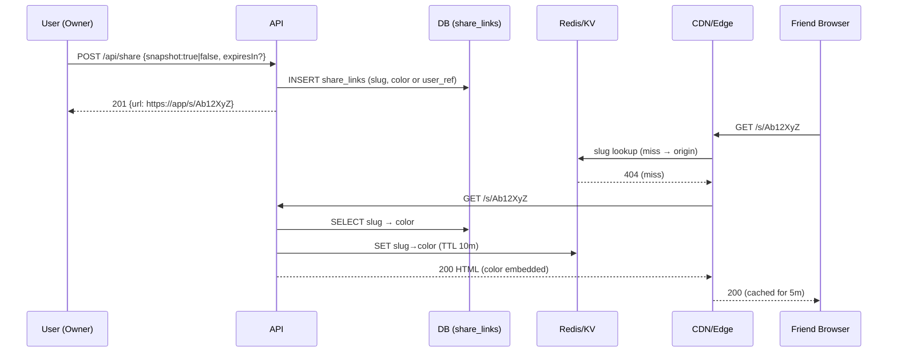
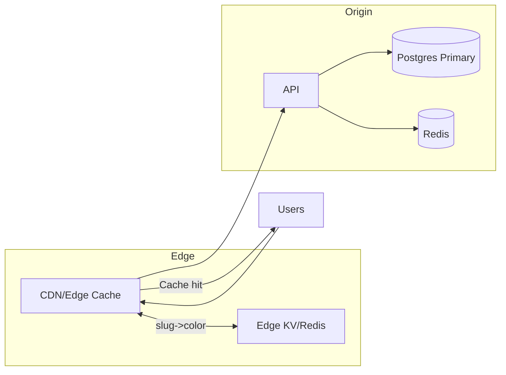
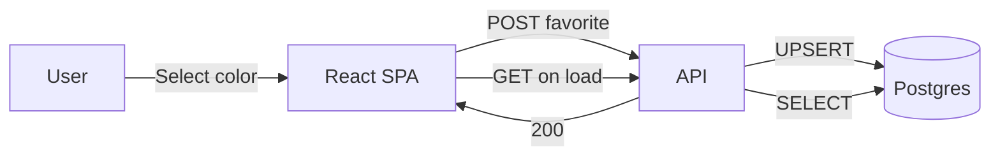
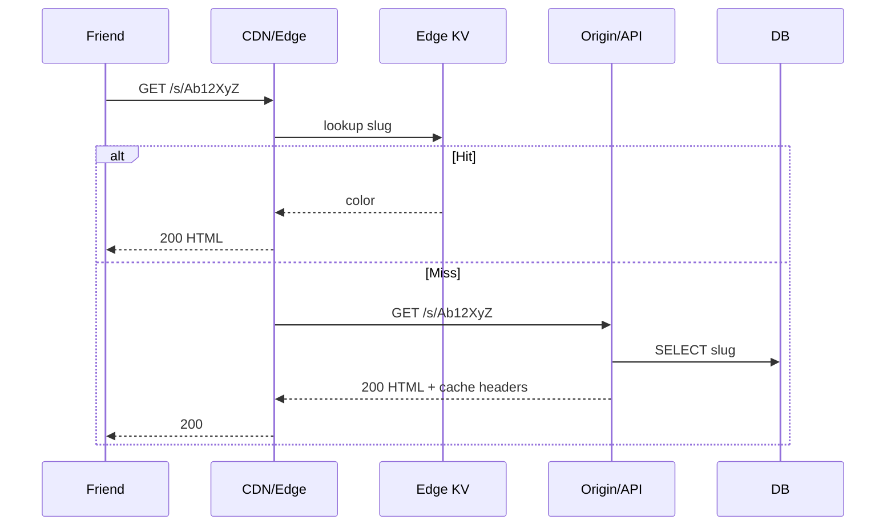

# Favorite Color Picker — 1‑Day Hackathon → Scale‑Ready System Design

**Goal:** Design and launch in **one day** a simple web app where a user picks a favorite color and saves it, then extend with **share‑with‑a‑friend** and a path to **massive scale**.

This document is structured as requested:

- **Part 1 – Introduction**
- **Part 2 – Web application design** (devops, tools, deployment, test automation)
- **Part 3 – Share with other users** (works for millions)
- **Part 4 – Scaling Up** (caching, CDNs)
- **Part 5 – Latency** (DB replication, load balancing, regional affinity, replication types)
- **Q&A** mapping to the four interview prompts
- **Appendix** (API spec, schema, test plan, SLOs)

Each part includes at least **one Mermaid diagram**, often more (flowcharts + sequences).  
We explicitly call out **trade‑offs** to show decision‑making and avoid over‑engineering.

---

## Part 1 — Introduction (Framing, MVP Scope, Constraints)

**MVP (1 day):**
- User can **select a color** (HEX, HSL, or named) and **save** it as their favorite.
- User can **see** their saved color on return.
- Auth: **email‑less** pseudo‑auth (anonymous session) for hackathon; upgrade path to OAuth later.
- Basic **share** link (copyable URL).

**Non‑functional targets (Day‑1 realistic):**
- p95 **save** < 300 ms (same region), p95 **read** < 200 ms.
- **99.5%** availability (hackathon), path to 99.9% with replicas.
- Rollouts: **CI/CD** from `main` with quick rollbacks.

**Assumptions:**
- Public internet app; low PII (just color + optional display name).
- No hard compliance in MVP; still follow basic security hygiene.
- Expect mobile traffic; responsive UI.

**Rubric mapping (what interviewers look for):**
- **Problem solving:** constrain MVP, phased evolution.
- **Technical proficiency:** storage, cache, CDN, WS/HTTP, replication options.
- **Operational mindset:** deploy, observe, rollback, rate‑limit, error paths.
- **Tech adaptability:** from serverless single region → multi‑region with cache & replicas.
- **Decision‑making:** justify “why this stack now” + “how it evolves”.

**High‑level (MVP) Architecture**

```mermaid
flowchart LR
  U[User Browser] --> CDN[CDN/Edge Cache]
  CDN --> FE[Static Frontend (SPA)]
  FE --> API[/Serverless API/]
  API --> DB[(Postgres)]
  API --> KV[(Redis/Serverless KV)]
```

Why this shape for day‑1?
- Speed of delivery (**serverless functions**, **managed Postgres**).
- **CDN** for static assets; optional KV for session/ratelimit.
- Simple to scale **vertically** first; clear seams for **horizontally** scaling later.

---

## Part 2 — Web Application Design

### 2.1 Stack & Tooling (1‑day deliverable)

- **Frontend:** React + a11y‑friendly color picker (native `<input type="color">` + HEX/HSL inputs).  
- **Backend:** Node.js (Express or serverless handler).  
- **Database:** Managed **Postgres** (e.g., Supabase/Neon/Railway/RDS).  
- **Cache/KV (optional‑but‑useful):** Redis or platform KV for sessions & hot reads.  
- **Deployment:** Vercel/Cloudflare Pages + Functions *or* Render/Heroku (pick one and commit).  
- **Infra as Code:** minimal (platform GUI ok for hackathon), document settings.  
- **CI/CD:** GitHub Actions → deploy on `main` with smoke tests.  
- **Observability:** platform logs, basic metrics, uptime check (Cron + /healthz).  
- **Testing:** unit (color validation), minimal API tests, one e2e with Playwright.

**MVP App Flow (Save & Read)**



### 2.2 Data Model (MVP)

```mermaid
erDiagram
    USER ||--o{ FAVORITE : has
    USER {
      uuid id PK
      text display_name
      timestamptz created_at
    }
    FAVORITE {
      uuid user_id FK
      text color_hex "e.g. #RRGGBB"
      text color_space "HEX|HSL|RGB"
      text color_value "normalized (e.g., 255,0,0)"
      timestamptz updated_at
    }
    SHARE_LINK {
      uuid id PK
      uuid owner_user_id FK
      text slug "short code"
      text color_hex
      timestamptz created_at
      timestamptz expires_at nullable
      int hits default 0
    }
```

**Schema (Postgres)**
- `users(id uuid pk, display_name text, created_at timestamptz)`  
- `favorites(user_id uuid pk fk, color_hex text check pattern, color_space text, color_value text, updated_at timestamptz)`  
- `share_links(id uuid pk, owner_user_id uuid fk, slug text unique, color_hex text, created_at timestamptz, expires_at timestamptz null, hits int)`

**Validation**
- Accept **HEX** `^#(?:[0-9a-fA-F]{3}){1,2}$`, normalize to `#RRGGBB`.
- Optionally store **HSL/RGB** normalized forms for analytics.

### 2.3 API (MVP)

- `GET /api/me` → returns session & current favorite (if any).  
- `POST /api/favorite {color:"#RRGGBB"}` → **idempotent** with `Idempotency-Key`.  
- `GET /api/favorite/:userId` → public only if shared (or owner).  
- `POST /api/share {expiresIn?}` → returns share URL (`/s/:slug`).  
- `GET /s/:slug` → resolves to **share page** with friend’s color.

### 2.4 DevOps, Deployment, Test Automation

**Deployment choice (Day‑1):** *Vercel* (or Cloudflare) for static + functions; **Neon/Supabase** for Postgres.  
**Alternatives:** *Render/Heroku* (container), or *Fly.io* (edge VMs).

**Pros/Cons (Serverless vs Container)**
- **Serverless (Preferred Day‑1):**
  - ✅ Fast to ship, autoscaling, built‑in CDN for static.
  - ❌ Possible cold starts; keep functions **small**.
- **Container (Alternative):**
  - ✅ Predictable performance, long‑running connections.
  - ❌ More setup (Dockerfile, runtime, autoscaling config).

**Testing (minimal but meaningful):**
- **Unit:** color validator, schema guards.
- **API integration:** save + idempotency + share link happy path.
- **E2E (Playwright):** pick color → persists → reload shows saved color.
- **Load smoke:** k6 script: 50 RPS for 2 min on `POST /api/favorite`.
- **Observability:** request logs, error rate alert, p95 latency chart.


---

## Part 3 — Share With Other Users (Millions‑scale capable)

### Goals
- Users can generate a **shareable link** others can open to view the color.  
- Scales to **millions of links** and **bursty traffic** (e.g., social virality).  
- Handle abuse: rate limiting, token entropy, optional expiry.

### Two Approaches (and a third optional)

#### A) **Public Short Code (Slug) + CDN Cache** ✅ *Preferred*
- On `POST /api/share`, create a **slug** (e.g., base‑62 length 7–9).  
- Store row in `share_links`; serve GET `/s/:slug`.  
- **CDN/Edge** caches the resolved **static share page** (HTML with embedded color) for TTL (e.g., 5 min); **KV/Redis** caches slug→color mapping.

**Pros:**
- Extremely **cache‑friendly**; CDN offloads origin.
- Cheap to serve at scale; quick edge render (or prerender to HTML).
- Slug decouples from user auth → trivial sharing.

**Cons:**
- Public by default—need clear UX to revoke or set expiry.
- If color changes after share, choose: **snapshot** (slug stores color) or **live view** (slug references user current color).

**Why preferred:** Most compatible with virality + CDN caching; minimal origin hits.

#### B) **Signed URL (JWT) with Optional Expiry**
- Generate a short‑lived **signed token** (JWT) carrying the color or userId + version.
- Client opens `/share?token=...`; server validates token and renders.  
- Optional: **single‑use** tokens.

**Pros:**
- Access control and expiry built‑in.
- No DB read needed if token carries color (stateless).

**Cons:**
- Harder to cache at edge (token uniqueness defeats cache) unless you normalize URL.
- Token leakage reduces control; revocation is tricky for already‑issued tokens.

**Fit:** When you need **temporary** or **access‑scoped** shares.

#### C) **Direct Message via Platform Integration** (Email/SMS/Slack)  
- Offload delivery; **Notification** microservice later.

**Pros:** Good UX, rate‑limited by provider.  
**Cons:** Vendor dependencies, not day‑1 essential.

### Sharing Flow (Preferred: Slug + Cache)



**Edge optimization:** Render **static HTML** with the color embedded → fully cacheable artifact (immutable by slug if snapshot).

**Abuse & Limits**
- **Rate limit** share creation per user/IP (token bucket in Redis).  
- Slug **entropy ≥ 42 bits** (e.g., 7 chars base‑62) to prevent guessing.  
- **Revoke** by deleting `share_links` row and purging CDN cache.


---

## Part 4 — Scaling Up (Caching, CDNs)

### Read/Write Paths to Optimize



**Caching Strategy**
- **Static assets**: long‑TTL immutable (hash‑named).  
- **Share pages**: cache at CDN (5–10m TTL) + **Edge KV** for slug resolution.  
- **API GETs**: short TTL (10–30s) per user; **do not** cache sensitive personalized data at CDN unless authenticated edge compute normalizes cache key.  
- **Write‑through**: For `POST /api/favorite`, invalidate user’s cached GET response.  
- **Service Worker** (optional): cache last favorite locally for instant UI on reload.

**Pros/Cons of Edge KV vs Central Redis**
- **Edge KV (Cloudflare KV/D1/Upstash global)**:
  - ✅ Low read latency globally, cheap for small values (slug→color).  
  - ❌ Eventual consistency; writes propagate in seconds.
- **Central Redis**:
  - ✅ Strong consistency and very fast near origin.  
  - ❌ Adds RTT for distant regions unless you add replicas.

**Preferred Hybrid:** Use **CDN + Edge KV** for read‑mostly share lookups; central Redis for sessions/ratelimits near origin.

---

## Part 5 — Latency (DB Replication, Load Balancing, Region Affinity)

### Replication & Topologies (Options)

#### Option 1 — **Single Primary + Read Replicas** ✅ *Preferred first scale step*
- DB writes go to **primary** (Region A).  
- **Read replicas** in Region A (same AZ) and optionally Region B.  
- App reads: **write‑through** (post‑write read uses primary) else **replicas** for public/share data.

**Pros:** Simple, predictable; avoids multi‑master conflicts.  
**Cons:** Cross‑region **write latency** remains high; replica lag (100ms–seconds).

#### Option 2 — **Multi‑Region Active‑Active**
- Datastore supports **multi‑writer** (e.g., CockroachDB/Spanner/DynamoDB GlobalTables).  
- Writes local to user’s region; conflict resolution is automated (TrueTime/CRDT/last‑writer).

**Pros:** Lowest **P50 write** latency per region; global availability.  
**Cons:** Cost, complexity, semantic conflicts (last‑writer wins) and migration effort.

#### Option 3 — **Leaderless** (Cassandra/Scylla + QUORUM)
- High write throughput; tunable consistency.

**Pros:** Massive scale.  
**Cons:** Operational complexity, different data model, not necessary for this app.

### Load Balancing & Regional Affinity

- **Global LB** (e.g., Cloudflare/Vercel/Route 53 latency‑based) routes to nearest edge/app region.  
- **Sticky sessions** not required—use stateless JWT or session in Redis.  
- **Region affinity**: if using single primary DB, route **write endpoints** to **primary region**; **read endpoints** can be anywhere + CDN.

### Replication for Caches
- **Redis**: primary + replicas; or use **Redis Enterprise/Upstash Global** with read local / write primary.  
- **KV at Edge**: accept eventual consistency; design share pages as **immutable** per slug (snapshot) to avoid correctness issues.

**Multi‑Region Diagram (Option 1)**

```mermaid
flowchart LR
  subgraph Global
    GLB[Global Load Balancer]
  end
  subgraph Region A (Primary)
    AFE[App/Functions]
    ADB[(Postgres Primary)]
    AR[Redis]
    ACDN[Edge POP]
  end
  subgraph Region B
    BFE[App/Functions]
    BDB[(Postgres Read Replica)]
    BCDN[Edge POP]
  end
  U[Users] --> GLB
  GLB --> ACDN
  GLB --> BCDN
  ACDN --> AFE --> ADB
  AFE --> AR
  BCDN --> BFE --> BDB
```

**Latency Tips**
- Keep **write paths** short: validate on edge, write at origin, respond with minimal payload.  
- Use **async** post‑write work (webhooks, analytics) via queue.  
- Pre‑render share pages in region + **push** to CDN on publish.


---

## Q&A — Mapping to Interview Prompts

### 1) Build a color picker + save in **1 day**

**Approach (Serverless + Postgres)**
- Use `<input type="color">` + HEX input with validation; React for UI.  
- Persistent session with `sessionId` cookie (anon user).  
- `POST /api/favorite` upserts row keyed by `user_id`.  
- Deploy frontend + API on Vercel; DB on Neon/Supabase.  
- Tests: validator unit test; one API test; one Playwright e2e.

**Mermaid — MVP Flow**



**Why this works in a day**
- Managed hosting, zero infra yak‑shaving.  
- Minimal schema, single endpoint, small UI surface.


### 2) Add **share with a friend**

**Preferred**: **Slug + CDN‑cached share page**.  
- `POST /api/share` → create `share_links` row (snapshot color) → return `/s/:slug`.  
- Friend opens link; CDN serves cached page (edge), minimal origin reads.

**Mermaid — Share Resolution**



### 3) System is breaking after big scale — where are bottlenecks & fixes?

**Likely bottlenecks**
- **Origin thundering herd** on popular share slugs (viral).  
- **DB connections** exhausted (serverless concurrency spikes).  
- **Cold starts** on serverless functions.  
- **Hot keys** in Redis (same slug/user).  
- **Replica lag** causing stale reads.

**Fixes (ordered)**
- **Aggressive CDN caching** for share pages; purge on revoke only.  
- **Connection pooling** (PgBouncer) and **queue** write bursts.  
- **Warm** functions (provisioned concurrency) for hot regions.  
- **Shard** Redis keys by prefix; add replicas.  
- **Use primary for post‑write reads** (read‑your‑write) where needed.


### 4) Some users crash/slow while others are fine — why?

**Common reasons**
- **Geography**: distant regions → higher RTT; some users hit a slow path without cache.  
- **Cache variance**: CDN miss vs hit; stale vs fresh POPs.  
- **Device/Network**: low‑end phones, 3G, older browsers (no HW accel for gradients).  
- **ISP or DNS issues**, packet loss.  
- **Cold starts** in one region only.  
- **Replica lag** leading to “missing” recent saves for some users.

**Mitigations**
- Pre‑connect/Preload; ship minimal JS; defer non‑critical.  
- Edge caching + **regional affinity** for writes.  
- Synthetic monitoring from multiple geos; RUM to correlate slowness with geo/ISP.  
- Feature‑flag heavy UI effects on low‑end devices.


---

## Trade‑offs & Alternatives Summary

| Area | Preferred | Alternatives | Why |
|---|---|---|---|
| Hosting | Serverless + Managed DB | Containers on Render/Fly | Faster day‑1 delivery |
| Storage | Postgres | DynamoDB (Global Tables), SQLite (local) | SQL ease; migrate later if needed |
| Sharing | Slug + CDN | Signed JWT tokens | Cacheability vs access control |
| Caching | CDN + Edge KV | Central Redis only | Global latency + cost |
| Replication | Single primary + replicas | Active‑active | Simpler semantics; upgrade later |
| Auth (MVP) | Anon session | OAuth | Reduce friction day‑1 |

---

## Appendix

### API Spec (v1)

```
GET  /api/me
→ 200 { sessionId, userId, favoriteColor?: "#RRGGBB" }

POST /api/favorite
Headers: Idempotency-Key: <uuid>
Body: { color: "#RRGGBB" }
→ 200 { userId, favoriteColor: "#RRGGBB", updatedAt }

POST /api/share
Body: { snapshot?: boolean, expiresInSec?: number }
→ 201 { slug, url }

GET  /s/:slug
→ 200 HTML (cached) or 404
```

### SQL Snippets

```sql
CREATE TABLE users (
  id uuid PRIMARY KEY DEFAULT gen_random_uuid(),
  display_name text,
  created_at timestamptz NOT NULL DEFAULT now()
);

CREATE TABLE favorites (
  user_id uuid PRIMARY KEY REFERENCES users(id) ON DELETE CASCADE,
  color_hex text NOT NULL CHECK (color_hex ~* '^#(?:[0-9a-f]{3}){1,2}$'),
  color_space text NOT NULL DEFAULT 'HEX',
  color_value text,
  updated_at timestamptz NOT NULL DEFAULT now()
);

CREATE TABLE share_links (
  id uuid PRIMARY KEY DEFAULT gen_random_uuid(),
  owner_user_id uuid REFERENCES users(id) ON DELETE CASCADE,
  slug text UNIQUE NOT NULL,
  color_hex text NOT NULL,
  created_at timestamptz NOT NULL DEFAULT now(),
  expires_at timestamptz,
  hits int NOT NULL DEFAULT 0
);
CREATE INDEX idx_share_not_expired ON share_links(slug) WHERE expires_at IS NULL OR expires_at > now();
```

### Basic Test Plan

- **Unit**: color validator (HEX normalize), slug generator entropy test.  
- **Integration**: favorite upsert, idempotency (duplicate POST), share create and fetch.  
- **E2E**: select color → saved → share link opens correct color.  
- **Load Smoke**: k6: 100 VUs, 60s, `POST /api/favorite` (idempotent).  
- **Chaos**: drop DB for 10s; API returns 503 with retry‑after; app shows offline message, local cache renders last known color.

### SLOs & Alerts

- **SLO:** p95 `POST /api/favorite` < 300 ms; error rate < 1%.  
- **Alerts:** surge in 5xx, DB connection pool > 80%, CDN hit rate < 80% on `/s/*`, replica lag > 2s.  
- **Dashboards:** latency histograms by region; cache hit ratio; slug popularity; RUM Web Vitals.


---

## Bonus: Future Evolution (When Needed, Not Day‑1)

- **OAuth login** → map favorites across devices.  
- **Multi‑color palettes**, comments on palettes.  
- **WebSockets** for live preview in shared sessions.  
- **Active‑active** DB for global writes.  
- **Edge rendering** for completely serverless originless share pages.

*End of document.*
