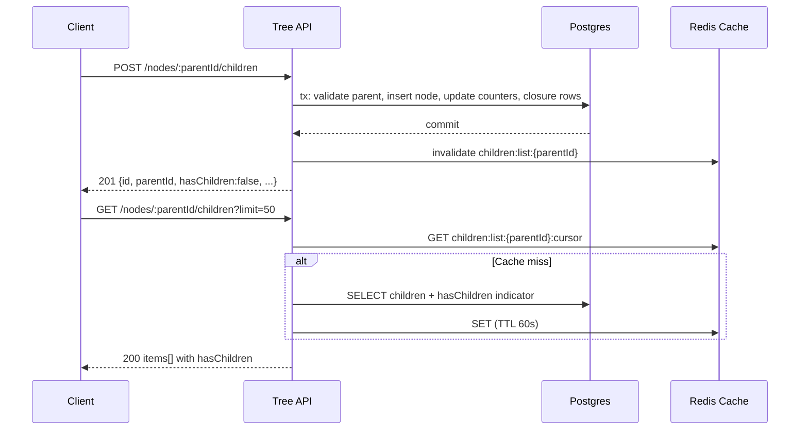
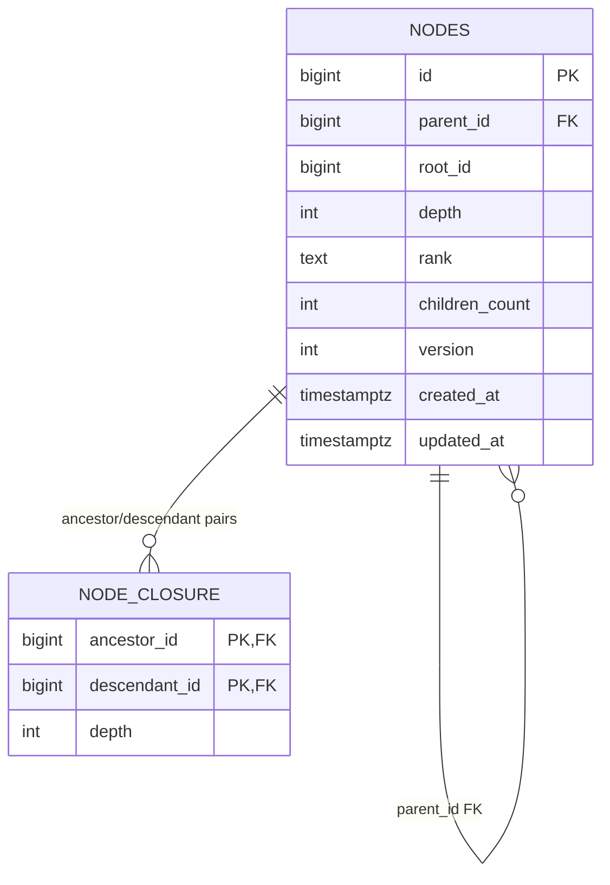
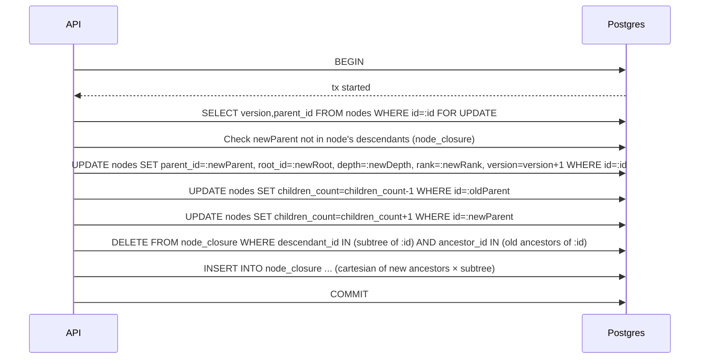
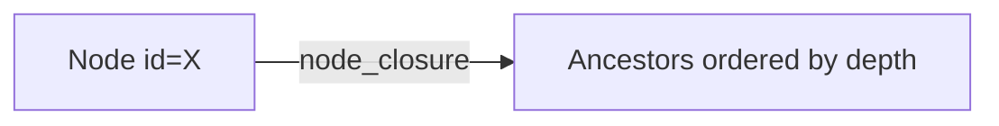
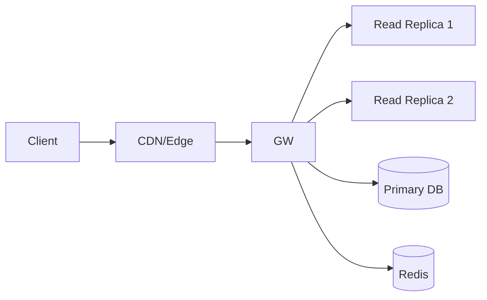
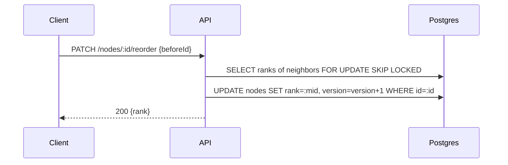
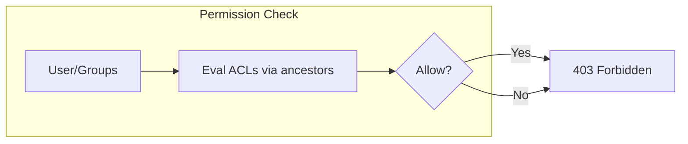

# Hierarchical Model Store — System Design (MVP → Scale)

Design a system to **store and retrieve hierarchical data** (multiple roots, each node can have many children).  
Focus on: **Add child**, **List children with TERMINAL indicator**, and evolution to **ancestors view**, **API scale**, **reorder nodes**, **permissions**.

We keep to interview rubrics: problem decomposition, trade‑offs, operational mindset, adaptability, and clear decisions.  
Every section includes a **Mermaid diagram**.

---

## Table of Contents

1. [Assumptions & Goals](#assumptions--goals)  
2. [Part 1 — API Design](#part-1--api-design)  
3. [Part 2 — Data Modelling](#part-2--data-modelling)  
4. [Part 3 — Box Diagram (Architecture)](#part-3--box-diagram-architecture)  
5. [Scale Up 1 — View Ancestors](#scale-up-1--view-ancestors)  
6. [Scale Up 2 — Scale APIs](#scale-up-2--scale-apis)  
7. [Scale Up 3 — Reorder Nodes](#scale-up-3--reorder-nodes)  
8. [Scale Up 4 — Permission Handling](#scale-up-4--permission-handling)  
9. [Operational Concerns](#operational-concerns)  
10. [Trade‑offs & Alternatives Cheat Sheet](#trade-offs--alternatives-cheat-sheet)

---

## Assumptions & Goals

- **Multiple root nodes** (a node with `parent_id = NULL` is a root).  
- **Arbitrary node payload** (opaque to this system).  
- **Core MVP**
  - Create root or child node.
  - Get children of any node **with TERMINAL indicator** = whether a child has children.
- **Non‑functional (MVP)**
  - p95 read < 200ms, p95 write < 300ms in one region; ~99.9% availability path.
- **DB choice**: Start with **PostgreSQL** (system of record), because ACID transactions & indexes make parent/child updates atomic. Add **Redis** for hot lists.

---

## Part 1 — API Design

**Resource**: `Node` with identity, parent linkage, order within parent, and derived flags.

### Endpoints (REST, cursor‑based)

```
POST   /nodes                         # create root
POST   /nodes/:parentId/children      # create child under parent
GET    /nodes/:id/children?limit=&cursor=
GET    /nodes/:id                     # get node (metadata only)
PATCH  /nodes/:id/move                # move to new parent and/or reorder
PATCH  /nodes/:id/reorder             # change order among siblings
GET    /roots?limit=&cursor=          # list root nodes
DELETE /nodes/:id                     # (optional) soft delete
```

**Request/Response Examples**

- **Create child**

```http
POST /nodes/123/children
Idempotency-Key: 5e8f-...

{
  "displayName": "Specs",
  "order": {"afterId": 456}  // or {"beforeId": ...}
}
```

```json
201 Created
{
  "id": 789,
  "parentId": 123,
  "rootId": 1,
  "depth": 3,
  "rank": "mQ3xP0aa",
  "hasChildren": false,         // terminal indicator on *this node*
  "createdAt": "2025-08-25T10:00:00Z",
  "version": 1
}
```

- **Get children with TERMINAL indicator**

```http
GET /nodes/123/children?limit=50&cursor=rank:mQ3xP0aa
```

```json
200 OK
{
  "parentId": 123,
  "items": [
    {"id": 456, "displayName": "Design", "hasChildren": true,  "rank": "mQ3xP0a9"},
    {"id": 789, "displayName": "Specs",  "hasChildren": false, "rank": "mQ3xP0aa"}
  ],
  "nextCursor": "rank:mQ3xP0b0"
}
```

- **Move (reparent + optional reorder)**

```http
PATCH /nodes/789/move
If-Match: "3"   // optimistic concurrency

{
  "newParentId": 456,
  "order": {"beforeId": 111}   // optional
}
```

**Errors & Semantics**
- `400` invalid parent (self or descendant).
- `404` not found / not visible.
- `409` version conflict; `409` rank collision retry.
- `422` cycle prevention failure (see data model).

#### Sequence — Create Child & List Children



---

## Part 2 — Data Modelling

We need **fast child listing** (with terminal indicator), **safe reparenting**, and later **fast ancestor queries**.

### Options

1) **Adjacency List** (parent pointer on each node) + **children_count**  
2) **Materialized Path** (store ancestry path text/array; e.g., Postgres `ltree`)  
3) **Closure Table** (all ancestor↔descendant pairs with depths)  
4) **Graph DB** (Neo4j) — powerful but overkill for MVP

**Decision (MVP → Scale):**
- **Primary**: Adjacency List **+ counters** for `children_count` and **rank** per parent.  
- **Add**: **Closure Table** for scalable ancestors (Scale Up 1).  
- (Optional) `ltree` if you prefer materialized path; closure is more explicit & portable.

### Tables (PostgreSQL)

```sql
CREATE TABLE nodes (
  id           BIGSERIAL PRIMARY KEY,
  parent_id    BIGINT NULL REFERENCES nodes(id) ON DELETE CASCADE,
  root_id      BIGINT NOT NULL,       -- id of top-most ancestor (self if root)
  depth        INT    NOT NULL,       -- distance from root (root=0)
  rank         TEXT   NOT NULL,       -- lexicographic order key among siblings
  display_name TEXT,
  children_count INT NOT NULL DEFAULT 0,  -- for TERMINAL indicator
  version      INT NOT NULL DEFAULT 1,
  created_at   TIMESTAMPTZ NOT NULL DEFAULT now(),
  updated_at   TIMESTAMPTZ NOT NULL DEFAULT now(),
  CONSTRAINT uq_sibling_rank UNIQUE (parent_id, rank)
);

-- Ancestor/Descendant pairs for fast ancestor queries (added in Scale Up 1)
CREATE TABLE node_closure (
  ancestor_id   BIGINT NOT NULL REFERENCES nodes(id) ON DELETE CASCADE,
  descendant_id BIGINT NOT NULL REFERENCES nodes(id) ON DELETE CASCADE,
  depth         INT    NOT NULL,   -- 0 for self, 1 parent, etc.
  PRIMARY KEY (ancestor_id, descendant_id)
);

-- Helpful indexes
CREATE INDEX idx_nodes_parent_rank ON nodes(parent_id, rank);
CREATE INDEX idx_nodes_root_rank   ON nodes(root_id, depth, rank);
CREATE INDEX idx_nodes_children_count ON nodes(children_count);
CREATE INDEX idx_closure_desc_anc_depth ON node_closure(descendant_id, ancestor_id, depth);
```

**Why counters?** `hasChildren = (children_count > 0)` → constant‑time terminal indicator without `EXISTS` subquery at scale. Updated transactionally on insert/delete/reparent.

**Cycle prevention**
- On `move` or `insert`, check that `newParentId` is **not** a descendant of the node:
  ```sql
  SELECT 1
  FROM node_closure
  WHERE ancestor_id = :nodeId AND descendant_id = :newParentId
  LIMIT 1;
  -- if exists → reject
  ```

#### ER Diagram



#### Query — Children with TERMINAL indicator

```sql
SELECT id, display_name, rank, (children_count > 0) AS has_children
FROM nodes
WHERE parent_id = $1
ORDER BY rank
LIMIT $limit OFFSET $offset; -- or keyset with rank > $cursor
```

> For keyset pagination (preferred): `WHERE parent_id=$1 AND rank > $cursor ORDER BY rank LIMIT $limit`

#### Sequence — Move / Reparent (with closure maintenance)



**Note:** subtree retrieval is `SELECT descendant_id FROM node_closure WHERE ancestor_id=:id`.

---

## Part 3 — Box Diagram (Architecture)

MVP as a **modular monolith** (Tree API + DB) with Redis cache; evolve when needed.

```mermaid
flowchart LR
  Client[Web / Mobile] --> GW[API Gateway]
  GW --> TreeAPI[Tree Service (REST)]
  TreeAPI --> Cache[(Redis)]
  TreeAPI --> DB[(Postgres)]
  TreeAPI --> Bus[(Outbox → Event Bus)]

  subgraph Async
    Bus --> Indexer[Search/Analytics (opt)]
    Bus --> Auditor[Audit Log]
  end
```

- **System of record**: Postgres (`nodes`, `node_closure`)
- **Cache**: children lists, unread counts (if used), small TTL with invalidation on writes.
- **Outbox**: emit `NodeCreated`, `NodeMoved`, `NodeDeleted` for downstreams (search, audit).

---

## Scale Up 1 — View Ancestors

Users want to see a node’s **ancestors** (breadcrumb to root).

### Approach A — Parent Pointers (DFS/BFS to root)
- Repeated joins `parent_id → parent_id ...` until root.  
- **Pros:** simple, no extra table.  
- **Cons:** O(depth) queries or recursive CTE; expensive across regions.

```sql
WITH RECURSIVE path AS (
  SELECT id, parent_id, display_name, 0 AS depth
  FROM nodes WHERE id=$1
  UNION ALL
  SELECT n.id, n.parent_id, n.display_name, p.depth+1
  FROM nodes n JOIN path p ON n.id = p.parent_id
)
SELECT * FROM path ORDER BY depth DESC; -- root..self
```

### Approach B — **Closure Table** ✅ *Preferred for scale*
- Single index lookup: `SELECT ancestors JOIN node_closure WHERE descendant_id=$1 ORDER BY depth DESC`  
- **Pros:** O(depth) rows but **one query**; perfect for permission checks and cycle checks.  
- **Cons:** extra writes on move/insert (maintain closure).

```sql
SELECT a.id, a.display_name, c.depth
FROM node_closure c
JOIN nodes a ON a.id = c.ancestor_id
WHERE c.descendant_id = $1
ORDER BY c.depth DESC;
```

### Approach C — Materialized Path (`ltree`)
- Store path like `'1.23.456'`; ancestors via operators.  
- **Pros:** compact, fast with `ltree` indexes.  
- **Cons:** move/reparent requires path rewrite for subtree.

**Decision:** Use **Closure Table** when ancestor queries, permission evaluation, or cycle checks are common/critical. Keep parent pointers too (they’re inexpensive).



---

## Scale Up 2 — Scale APIs

### Read Scaling
- **Keyset pagination** by `rank`.  
- **Redis cache** for `children:list:{parentId}:{cursor}` (TTL 30–60s); invalidate on mutations under that parent.  
- **ETag/If-None-Match** for child lists (hash of ranks + versions).  
- **Replicas**: move read traffic to read replicas; **read‑your‑write** via primary TTL routing.

### Write Scaling
- **Idempotency-Key** on create/move.  
- **Rank keys** avoid O(n) sibling updates.  
- **Batch moves** via background jobs.

### Sharding & Partitioning
- Partition `nodes`/`node_closure` by **tenant_id** (if multi‑tenant) or by **root_id hash**.  
- Keep closure partitions aligned with nodes to avoid cross‑shard joins.

### Observability & Limits
- SLIs: p95 latency by endpoint, DB CPU/locks, cache hit ratio.  
- Limits: max depth (e.g., 256), max children per parent (soft).



---

## Scale Up 3 — Reorder Nodes

Ordering among siblings must be efficient and concurrent‑friendly.

### Approaches

**A) Integer Positions**
- `position INT` per sibling; moving item shifts many rows.  
- **Pros:** simple to reason about.  
- **Cons:** O(n) writes; contention under load.

**B) **Lexicographic Rank Keys** (fractional indexing) ✅ *Preferred*
- `rank TEXT` (base‑62). Insert between two ranks by computing a midpoint.  
- **Pros:** O(1) average write; great for concurrency.  
- **Cons:** Periodic **rebalance** when gaps get tight.

**C) Linked List Pointers**
- `next_sibling_id`; needs materialization for reads; fragile on failures.

**DDL & Constraints**

```sql
ALTER TABLE nodes ADD CONSTRAINT uq_sibling_rank UNIQUE (parent_id, rank);
```

**Reorder Flow**



**Mid‑key Pseudocode**

```python
def mid_key(left: str|None, right: str|None, width=8) -> str:
    if left is None and right is None: return "m"*width
    if left is None: return decrement(right)
    if right is None: return increment(left)
    return average_base62(left, right)
```

---

## Scale Up 4 — Permission Handling

We need per‑node **ACLs** with **inheritance** along ancestors; overrides allowed.

### Model

```sql
CREATE TABLE acl_entries (
  node_id    BIGINT NOT NULL REFERENCES nodes(id) ON DELETE CASCADE,
  subject_id BIGINT NOT NULL, -- user or group id
  perm       TEXT   NOT NULL CHECK (perm IN ('read','write','admin')),
  effect     TEXT   NOT NULL CHECK (effect IN ('allow','deny')),
  scope      TEXT   NOT NULL CHECK (scope IN ('node','subtree')), -- optional
  PRIMARY KEY (node_id, subject_id, perm)
);

CREATE INDEX idx_acl_subject ON acl_entries(subject_id, perm, effect);
```

**Evaluate Effective Permission (read)**
- Collect ACLs from **ancestors + node** (via closure or path).  
- Combine with **deny > allow** precedence; admin implies write implies read.  
- Cache subject→node `effectivePerm` short‑term.

```sql
SELECT * FROM acl_entries
WHERE (node_id = :nodeId OR node_id IN (
  SELECT ancestor_id FROM node_closure WHERE descendant_id=:nodeId
))
AND subject_id IN (:userId, :groupIds);
```

**Approaches**

- **A) On‑read evaluation (Preferred initially)**  
  - **Pros:** No complex denorm; correct after any change.  
  - **Cons:** Join cost; mitigate with caching + indexes.
- **B) Precomputed effective ACLs**  
  - Denormalize into `acl_effective(subject_id, node_id, perm)` via async worker.  
  - **Pros:** Very fast checks. **Cons:** Complex to keep in sync on reparent/mass updates.
- **C) Capability tokens (signed)**  
  - Good for sharing links. **Cons:** revocation tricky unless short‑lived.



---

## Operational Concerns

- **Consistency**: children lists cached with TTL; mutations **invalidate** parent’s list keys.  
- **Read‑your‑write**: route immediate post‑write reads to DB primary for the actor.  
- **Idempotency**: `Idempotency-Key` for create/move.  
- **Migrations**: closure table backfills; online index builds.  
- **Backups & PITR**; audit events on move/reparent/delete.  
- **SLIs**: p95 latency, error rate; **SLO** budgets and burn alerts.

---

## Trade‑offs & Alternatives Cheat Sheet

| Concern | Option | Pros | Cons | Pick |
|---|---|---|---|---|
| Child listing | Adjacency + COUNT | Simple | Expensive at scale | ❌ |
|  | Adjacency + **children_count** | O(1) terminal | Counter maintenance | ✅ |
| Ancestors | Parent recursion | No extra table | Slow for deep trees | ❌ |
|  | **Closure table** | Fast, flexible | More write work | ✅ |
| Ordering | Integer positions | Simple small lists | O(n) moves | ❌ |
|  | **Rank keys** | O(1) moves | Rebalance complexity | ✅ |
| Permissions | On-read via closure | Correct, simple | Join cost | ✅ |
|  | Precomputed effective | Fast checks | Denorm complexity | ⬜ (later) |
| Storage | Postgres | ACID, indexes | Sharding later | ✅ |
|  | Graph DB | Rich queries | Ops/lock‑in | ⬜ (niche) |

---

*End of document.*
