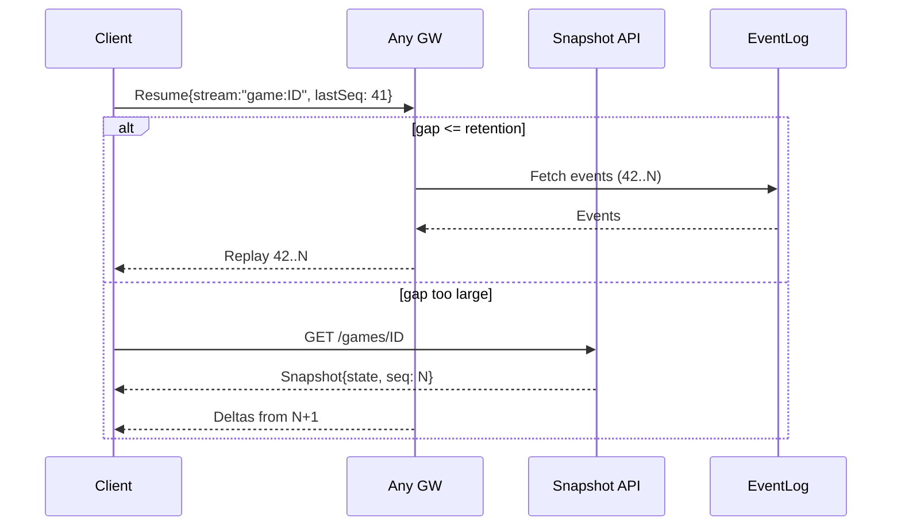
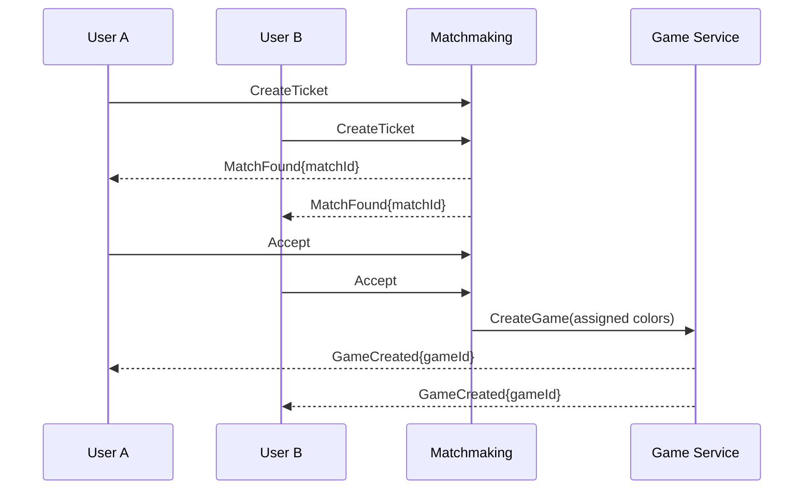
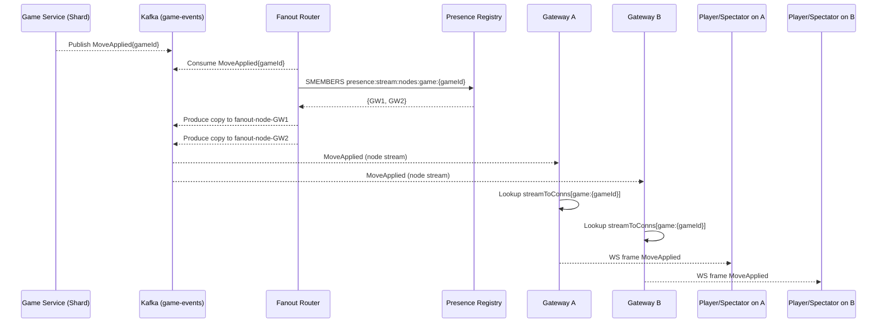
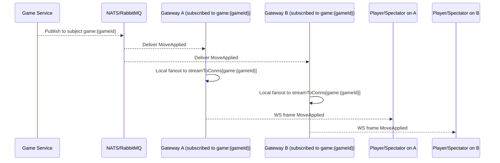

## Online Chess Platform (Chess.com-like) – System Design

### Goals and scope

- **Primary goals**: Head-to-head chess games, matchmaking, real-time moves, clocks/time-controls, resign/draw, chat, rematches, leaderboards, ratings (Elo/Glicko), tournaments/events, spectating, reconnect/resume, mobile + web clients.
- **Non-goals (initially)**: Full lessons/coaches, complex tournament formats, variants beyond standard (can be an extension), full social network.

### Functional requirements

- **Account & profile**: Register/login, profile, rating per time-control (bullet/blitz/rapid/classical), history.
- **Matchmaking**: Join queue by time-control and rating band; accept match; bot fallback.
- **Game lifecycle**: Create game, color assignment, legal move validation, time decrement, draw/resign/timeout, game termination with reason.
- **Real-time**: Sub-200 ms end-to-end move propagation; ordered, exactly-once-visible to a board; clock ticks at 1s with drift ≤150 ms.
- **Leaderboards**: Periodic/global/time-control specific; daily/weekly/monthly; country/club filters.
- **Spectating**: Read-only subscription to board; limited fanout; anti-ghosting.
- **Reconnection**: Resume stream, fetch missed events, no duplicated visible moves, state recovery including clocks.
- **Moderation & anti-cheat**: Server-authoritative state, heuristic/ML detection, limits & audit.

### Non-functional requirements

- **Scale**: 2–5M DAU, 300k–800k concurrent users, 150k–300k concurrent games, 1–3M concurrent connections (multi-device + spectators).
- **Availability**: 99.95%+; multi-zone; graceful degradation for spectating.
- **Latency**: p95 < 200 ms move fanout; p99 < 400 ms; low drift for clocks.
- **Consistency**: Strong per-game state; eventual across aggregates (leaderboards).
- **Cost**: Efficient persistent connections; pub/sub fanout; cache-first reads.

---

### High-level architecture

```mermaid
graph TD
  Client[Web/Mobile Clients] -- WS/SSE --> GW[Realtime Gateway Layer]
  GW -- pub/sub --> Bus[Event Bus (Kafka/NATS)]
  GW -- REST/gRPC --> API[API Gateway]
  API --> Auth[Auth Service]
  API --> Match[Matchmaking Service]
  API --> Game[Game Service]
  API --> Leader[Leaderboard Service]
  API --> Profile[User/Profile Service]
  Game --> StateDB[(Game DB: Postgres/Scylla)]
  Game --> Cache[Redis/Memcache]
  Game --> Eval[Move Validator/Rules Engine]
  Game --> Sched[Clock Scheduler]
  Match --> QueueDB[(Match/Queue Store)]
  Leader --> OLAP[(OLAP/ClickHouse)]
  Bus --> GW
  Bus --> Game
  Bus --> Leader
  Observ[Telemetry/Logging] -.-> All
  subgraph Data
    StateDB
    QueueDB
    OLAP
    Cache
  end
  subgraph Services
    Auth
    Match
    Game
    Leader
    Profile
    Sched
    Eval
  end
  subgraph Edge
    Client
    GW
    API
  end
  All[[All Services]]
```

---

### Data model (core)

- **User**
  - userId, handle, country, ratings: map(timeControl → rating, deviation, volatility), createdAt, flags.
- **Game** (immutable identity + evolving state)
  - gameId (ULID), whiteUserId, blackUserId, timeControl, increments, rated, variant, createdAt, status, result, terminationReason.
  - stateVersion (monotonic), fen, movesCount, activeColor, clocks {whiteMs, blackMs}, lastMoveAt, drawOffers.
- **Move** (append-only)
  - moveId (ULID), gameId, seqNo, from, to, promo, san, checkFlags, resultingFEN, madeBy, serverTs, clientTs, latencyMs.
- **MatchTicket**
  - ticketId, userId, desiredTimeControl, rating, mmrRange, createdAt, status.
- **LeaderboardRow**
  - periodKey (e.g., daily:2025-08-10), timeControl, userId, rating, streak, games, rank.
- **EventLog** (immutable)
  - streamKey (game:gameId), seqNo, eventType, payload, ts.

Storage choices:

- OLTP: Postgres (partitioned by time/gameId) or Scylla/Cassandra for write-heavy moves.
- Cache: Redis for hot game state, presence, session tokens.
- Event bus: Kafka (ordering by gameId partition key) or NATS JetStream for simpler ops.
- OLAP: ClickHouse/BigQuery for analytics/leaderboards rollups.

---

### API surface (selected)

- Auth: `POST /v1/auth/login`, `POST /v1/auth/refresh`
- Matchmaking:
  - `POST /v1/match/ticket` {timeControl, rated}
  - `DELETE /v1/match/ticket/{id}`
  - `POST /v1/match/accept` {matchId}
- Games:
  - `POST /v1/games` (direct challenge) {opponentId, timeControl}
  - `GET /v1/games/{gameId}` returns canonical state
  - `POST /v1/games/{gameId}/move` {from,to,promo,clientSeq}
  - `POST /v1/games/{gameId}/resign`
  - `POST /v1/games/{gameId}/offer-draw`, `POST /v1/games/{gameId}/accept-draw`
- Leaderboards:
  - `GET /v1/leaderboards?period=daily&timeControl=blitz`
- Realtime handshake:
  - `POST /v1/realtime/token` → short-lived JWT for WS auth

Realtime channels/topics:

- `user:{userId}` presence and invites
- `game:{gameId}` authoritative moves/clock/events
- `spectate:{gameId}` rate-limited fanout

---

### Realtime transport and move propagation

- **Primary**: WebSockets
  - Full-duplex, lightweight framing, low per-message overhead, efficient for many small messages.
- **Fallbacks**: SSE (uni-directional, good for spectators), HTTP long-poll as last resort.
- **Mobile push**: Out-of-app alerting for match found, move reminders.

Message shape (JSON or compact protobuf over WS):

```json
{
  "stream": "game:01HV...",
  "seq": 42,
  "type": "MoveApplied",
  "at": 1699999999,
  "payload": {
    "from": "e2",
    "to": "e4",
    "san": "e4",
    "madeBy": "white",
    "whiteMs": 299500,
    "blackMs": 300000
  }
}
```

Ordering & idempotency:

- Partition event bus by `gameId` to preserve order.
- Each event bears a strictly increasing `seq`. Gateways drop duplicates and buffer out-of-order until gap fills.
- Client sends `clientSeq` for dedup; server issues authoritative `seq`.

Backpressure & flow control:

- Per-connection send queue with high/low watermarks; apply compression (permessage-deflate) and message coalescing (clock ticks batched at 1 Hz).
- If client is slow, downgrade to SSE or reduce tick rate; eventually drop spectators first.

Reconnect & resume:

- Client stores last `seq` by stream; on reconnect sends `ResumeRequest {stream, lastSeq}`; gateway fetches gap from EventLog or Game Service cache and replays.
- If gap too large or retention expired, fetch full state snapshot then resume.

Heartbeats & liveness:

- Ping/pong at 15–30s; TCP keepalive; disconnect after grace; application-level idle timeouts for spectators.

---

### Realtime gateway layer at scale

```mermaid
graph LR
  LB[Layer 4 Load Balancer] --- GW1[GW Node A]
  LB --- GW2[GW Node B]
  LB --- GW3[GW Node C]
  subgraph Control Plane
    PR[Presence Registry (Redis/etcd)]
    RM[Routing Map (Consistent Hashing)]
  end
  GW1 -- subscribe game:K --> Bus[(Kafka/NATS)]
  GW2 -- subscribe game:K --> Bus
  GW3 -- subscribe spectate:K --> Bus
  Bus --> GameSvc[Game Service Shards]
```

- **Ingress**: L4/TCP (e.g., AWS NLB) for millions of sockets; no TLS termination at LB when using PROXY protocol; terminate at GW for metrics and mutual TLS to backend.
- **Session affinity**: Sticky by `clientId` optional; not required for resume because resume protocol is stateless relative to GW.
- **Subscription model**:
  - GW nodes maintain per-stream subscriber sets in-memory; optional shadow index in Redis for fast failover.
  - GW subscribes to topics on Bus using `gameId` consistent hashing for partition locality.
- **Sharding**:
  - `gameId` → partition key for Bus; `gameId` → shard for Game Service using consistent hashing ring. Keep producer (Game Service shard) and consumer (GW) close (AZ-local) to reduce cross-zone traffic.
- **Presence**:
  - Store `userId -> connectionIds` and `gameId -> connectionIds` with TTL heartbeats in Redis Cluster. Used for invites, friends online, and cleanup.
- **Capacity**:
  - Event-loop servers (Netty/Elixir/Epoll/Kqueue). 50k–100k sockets per node with 1–2 GB heap + native buffers. Monitor file descriptors, SYN backlog, TLS CPU.

---

### Game service: authoritative engine

- Validates and applies moves server-side using a rules engine (e.g., Stockfish as validator in low-strength mode or pure rules library) to prevent illegal moves and enforce turn order.
- Maintains canonical FEN, move list, and clocks; emits events to Bus.
- Clock scheduler co-located for games on its shard to minimize jitter; tick at 1 Hz or event-driven decrement on moves with last-seen timestamp.
- Draw/resign/timeout detection; threefold repetition, 50-move rule, stalemate, insufficient material.
- Anti-abuse: rate-limit move attempts, detect impossible timestamps, freeze on suspicion and audit.

Concurrency & isolation:

- Single-threaded per-game mailbox (actor model). All mutations for a `gameId` are serialized on its shard to avoid locking.
- State caching: hot state in Redis with write-through on terminal events; cold replay from EventLog for recovery.

Idempotent commands:

- `clientMoveId` generated by client; dedupe within `gameId`. Safe for retries after reconnect.

---

### Matchmaking service

- Pools per time-control and rating bucket; sliding window expansion over time (e.g., ±50 Elo every 5s).
- Accept handshake: both players must confirm within T seconds; else requeue.
- Geographic/AZ-aware pairing to reduce move latency.
- Bot fallback: configurable difficulty; transparent labeling.
- Stores ticket and match decisions in persistent queue store; emits `MatchFound` → clients via `user:{userId}` stream.

---

### Leaderboards and ratings

- Ratings: Elo or Glicko-2 per time-control. Update as an event from Game Service post-termination.
- Leaderboards: materialized views in Redis (Sorted Sets) for hot ranks, backed by ClickHouse rollups updated by stream processors (Kafka consumers). Period windows (daily/weekly/monthly) using sparse updates and periodic compaction.
- Consistency: eventual; use sequence numbers per user to prevent out-of-order rating application in rollups.

---

### Eventing and consistency patterns

- Bus topics:
  - `game-events` (keyed by gameId) for ordered game state.
  - `user-events` (keyed by userId) for invites, presence pings.
  - `leaderboard-updates` for rating deltas.
- Delivery semantics:
  - At-least-once on Bus; idempotent consumers using `seq` and dedupe caches.
  - Exactly-once-visible on client streams using `seq` and drop/ignore duplicates.

Snapshot + delta:

- For new spectators or reconnect with large gap: serve snapshot (`GET /v1/games/{id}`) then start deltas from current `seq`.

---

### Failure handling and recovery

- GW node loss: clients reconnect through LB; resume protocol fetches missed events from EventLog/Redis cache.
- Shard failover: leader election per shard; recovered from EventLog + recent Redis snapshot; in-flight command queue retried idempotently.
- Bus outage: buffer small windows at Game Service (bounded), apply backpressure to ingestion; degrade spectators first.
- Partial outages: block rated matchmaking while allowing unrated/bots; freeze ratings updates on read replica lag.

---

### Security and abuse prevention

- JWT auth on WS upgrade; OAuth for account.
- Rate limits on commands and chat; WAF for HTTP endpoints.
- Anti-cheat: server-authoritative state, engine-usage heuristics (move-match rates, time profiles), secure comms, delayed bans to protect signals, separate ML pipeline.
- Privacy: PII in separate store; encryption at rest; data minimization in events.

---

### Observability

- Metrics: per-stream e2e latency, GW queue sizes, reconnect rates, dropped messages, p95/p99 clock drift, shard load.
- Tracing: move command → Game Service apply → Bus → GW send → client ack (when available).
- Logging: structured, sampling on spectators; redaction.

---

### Capacity planning (back-of-envelope)

- Connections: 1M sockets → ~20–30 GW nodes at 40–60k sockets each.
- Throughput: average 0.2 msgs/s per connection; peak fanouts during tournaments; provision Bus partitions ~2–3x peak.
- Bandwidth: moves small (<200 bytes); clocks 1 Hz per active game but coalesced; compress text frames.

---

### Deployment & evolution

- Multi-AZ, active-active. Consistent hashing ring per AZ, with spillover.
- Blue/green for GW and services with connection draining.
- Schema evolution via protobuf with backward compatibility; feature flags for new message types.

---

### Example sequences

Move flow (ordered, resume-capable):

```mermaid
sequenceDiagram
  participant C as Client
  participant GW as Realtime Gateway
  participant G as Game Service (Shard)
  participant B as Event Bus

  C->>GW: WS send MakeMove{from,to,promo,clientSeq}
  GW->>G: gRPC ApplyMove
  G->>G: Validate & Apply (actor per game)
  G-->>B: Publish MoveApplied{seq}
  B-->>GW: MoveApplied{seq}
  GW-->>C: MoveApplied{seq}
  Note over C,GW: Client updates board; stores last seq
```

Reconnect & gap fill:



Matchmaking accept:



---

### Selected schemas

- Move command (client → server):

```json
{
  "gameId": "01H...",
  "clientSeq": 17,
  "from": "e2",
  "to": "e4",
  "promo": "q"
}
```

- Move applied (server → clients):

```json
{
  "seq": 42,
  "fen": "rnbqkbnr/pppppppp/8/8/4P3/8/PPPP1PPP/RNBQKBNR b KQkq - 0 1",
  "san": "e4",
  "clocks": { "whiteMs": 299500, "blackMs": 300000 },
  "madeBy": "white"
}
```

---

### Implementation notes and trade-offs

- WS vs SSE: WS for bi-directional (moves, chat). SSE simpler for spectators; auto-reconnect built-in; no binary. Prefer WS for players.
- State in cache: Keep only active games in Redis with TTL; evict on termination. Persist full move list to OLTP for history.
- Partitioning: By `gameId` keeps single-writer invariant and simplifies ordering. Cross-game ops (leaderboards) are eventually consistent.
- Clocks: Either scheduled ticks or eventful delta-on-demand; hybrid works well (tick at low Hz + recalculated drift on move).
- Tournaments: Treat as many concurrent games; separate service orchestrates pairings and round switches.

---

### Testing and SLOs

- Chaos testing: kill GW nodes, inject Bus delays, shard failovers; verify resume and no duplicate-visible events.
- Load tests: steady connections, spiky fanout (spectator surges), backpressure behavior.
- SLOs: move e2e latency, resume success within 2s, missed-event rate < 1e-6, clock drift p99 < 150 ms.

---

### WebSocket connection state and broadcast routing

This section explains how we store connection/subscription state and how we decide which sockets receive a move update.

Data structures

- In-memory on each gateway node:
  - `connections`: Map<connectionId → {userId, deviceId, streams:Set<string>, lastSeenTs}>
  - `streamToConns`: Map<streamKey → Set<connectionId>> (e.g., `game:{gameId}`, `spectate:{gameId}`)
  - `userToConns`: Map<userId → Set<connectionId>>
- Shared registry (Redis/etcd):
  - `presence:user:{userId}` → Set<connectionId>, TTL heartbeats
  - `presence:conn:{connectionId}` → {userId, nodeId, streams[]}, TTL
  - `presence:stream:nodes:{streamKey}` → Set<nodeId> currently serving this stream
  - `presence:node:streams:{nodeId}` → Set<streamKey> this node serves

Lifecycle on connect/subscribe

- Connect: authenticate, allocate `connectionId`, insert into `connections` and `userToConns`, write `presence:conn:*` and add to `presence:user:*` with TTL.
- Subscribe(streamKey):
  - Add to `connections[conn].streams` and `streamToConns[streamKey]`.
  - If local subscribers for `streamKey` transitioned from 0 → 1, register node interest: add `nodeId` to `presence:stream:nodes:{streamKey}` and to `presence:node:streams:{nodeId}`. Also create broker subscription if using interest-based broker.
- Unsubscribe/disconnect: symmetric removal; on last local subscriber 1 → 0, drop interest and broker subscription.

Broadcast decision strategies

- Interest-based broker (e.g., NATS/RabbitMQ topic exchange):
  - Each gateway dynamically subscribes to `game:{gameId}` subject only when it has ≥1 local subscriber.
  - Game Service publishes `MoveApplied` to `game:{gameId}`; the broker delivers only to gateways with active subscriptions; each gateway then fans out to `streamToConns[streamKey]` locally.
  - Pros: no extra router hop; true interest delivery. Cons: high subscription cardinality if many concurrent streams.
- Per-node fanout router (Kafka-friendly):
  - Game Service publishes `MoveApplied` to `game-events` keyed by `gameId` (ordered per game).
  - A lightweight Fanout Router consumes `game-events`, looks up `presence:stream:nodes:{gameId}` to get target `nodeIds`, and publishes one copy per target onto `fanout-node-{nodeId}` topics (keyed by `nodeId`).
  - Each gateway consumes only its `fanout-node-{nodeId}` topic and locally fans out to `streamToConns[game:{gameId}]` and `streamToConns[spectate:{gameId}]`.
  - Pros: efficient with Kafka; limited consumer groups; low cross-node chatter. Cons: extra hop; needs presence registry.

Mermaid: connect and subscribe

```mermaid
sequenceDiagram
  participant Client
  participant GW as Gateway Node
  participant PR as Presence Registry (Redis)
  participant Broker as Broker (NATS/Kafka)

  Client->>GW: WS Upgrade + JWT
  GW->>GW: Create connectionId; add to in-memory maps
  GW->>PR: SET presence:conn:{connId} TTL
  GW->>PR: SADD presence:user:{userId} {connId}
  Client->>GW: Subscribe(stream="game:{gameId}")
  GW->>GW: streamToConns[stream].add(connId)
  alt first local subscriber for stream
    GW->>PR: SADD presence:stream:nodes:{stream} {nodeId}
    GW->>PR: SADD presence:node:streams:{nodeId} {stream}
    GW->>Broker: Subscribe to stream (if interest-based)
  end
  GW-->>Client: Subscribed Ack
```

Mermaid: move fanout (Kafka + Router pattern)



Mermaid: move fanout (Interest-based broker pattern)



Operational notes

- Use TTLs and periodic heartbeats to keep `presence:*` keys fresh. On node crash, keys expire and router stops targeting the node.
- Maintain small per-stream subscriber counts in memory for quick checks; only touch Redis on 0↔1 transitions.
- For separate spectator channels, apply rate limits and optional sampling to reduce load.
- When both players of a game are on the same node, fanout is purely local; no cross-node traffic.
