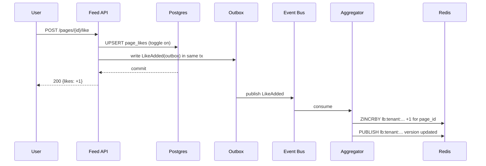
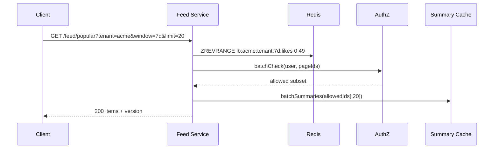
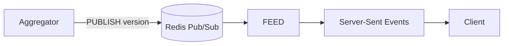

# Part 3 — High-Level Architecture Design

We separate system of record (Postgres) from read-optimized leaderboard caches (Redis ZSET). A streaming aggregator updates rankings on likes/views events. AuthZ is enforced at read time.

---

## Components

```mermaid
flowchart LR
  Client[Mobile/Web/Desktop] --> BFF[BFF/Edge API]
  BFF --> FEED[Popular Feed Service]
  FEED --> AUTHZ[AuthZ Service]
  FEED --> SUMM[Summary/Index Service]
  FEED --> REDIS[(Redis ZSETs)]
  FEED --> PG[(Postgres)]
  FEED --> OUTBOX[Outbox]

  OUTBOX --> BUS[(Kafka/NATS Events)]
  BUS --> AGG[Aggregator (Stream Proc)]
  AGG --> REDIS
  AGG --> STATS[(page_stats)]
  AGG --> SNAP[(leaderboard_snapshots)]
```

Write Path (likes/views)

- BFF -> Feed Service -> Postgres write (transaction).
- Outbox row written in same tx.
- Stream processors consume events -> update page_stats, Redis ZSET, and snapshots periodically.

Read Path (feed)

- BFF -> Feed Service:
  1. Read Redis ZSET top-N for (tenant, scope, window, metric).
  2. AuthZ filter by user; backfill from ZSET beyond N to fill page if some are filtered out.
  3. Summaries hydrated from summary service / cache.
  4. Return SDUI cards + version.

---

## Sequences

### Like Toggle -> Leaderboard Update



### Feed Fetch (with AuthZ & Summaries)



---

## Realtime Refresh

Prefer SSE (simple, uni-directional) with a version topic per leaderboard key. WS if bi-directional needed.



Client receives a new version -> calls /delta.

---

## Further Reading and Capacity Implications

- See deep dive of alternative designs and tradeoffs in `popular-feed-architecture-deep-dive.md`.
- See sizing and throughput math in `popular-feed-capacity-estimation.md`.

Capacity highlights that influence design:

- At small-to-medium scale, trimmed Redis ZSET leaderboards with an outbox-driven aggregator meet latency and freshness SLAs at low cost.
- As write volume (especially views) grows, per-event write amplification across windows/segments can dominate. Introduce time-bucket counters and periodic top-K compaction, or move raw counters to a wide-column store (e.g., Cassandra) and compute top-K in stream before publishing only K entries to Redis.
- If filters/windows become highly combinatorial, consider OLAP/materialized views for serving flexible queries, backed by caching, with an acceptance of slightly higher tail latency vs Redis.
- For massive read fanout with looser freshness, batch snapshots + CDN can drastically reduce origin load; pair with a lightweight real-time delta path.
