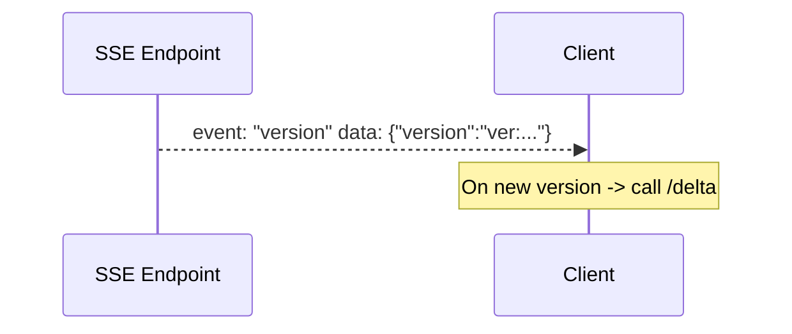
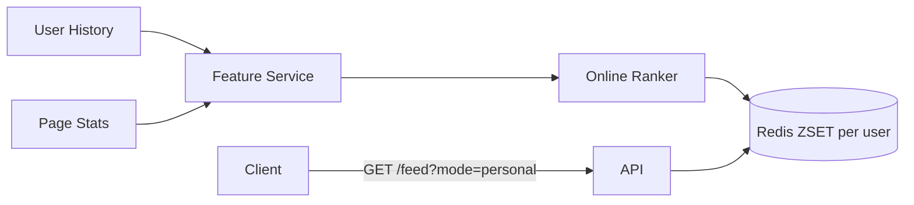
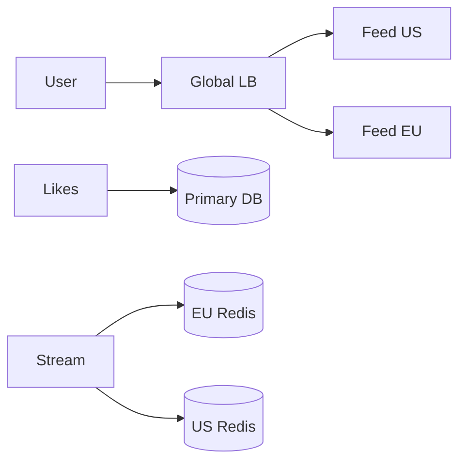
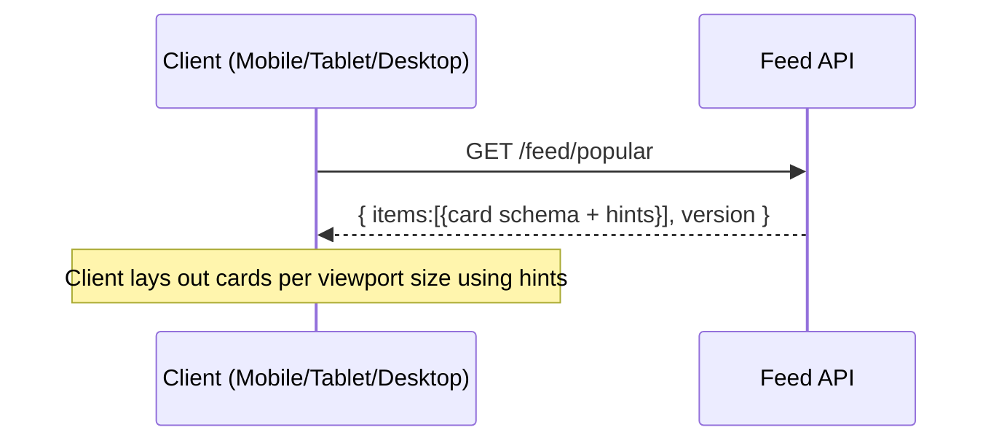

# Part 4 — Level Ups (Realtime, Ranking, Personalization, Scale)

This section deep-dives into refresh strategies, ranking beyond likes, personalization, multi-region, and operational concerns.

---

## 4.1 Realtime Refresh Strategies

A) Poll + ETag (Baseline)
- Client polls /feed/popular every 30–60s with If-None-Match: <version>.
- Pros: trivial; survives proxies. Cons: delay spikes; wasted calls.

B) SSE (Recommended)
- /feed/popular/stream?... pushes {"version": "..."} when leaderboard changes.
- Client then GETs /delta.
- Pros: low cost, easy; Cons: uni-directional only.

C) WebSocket
- Needed for 2-way interactions (typing, comments), overkill for feed only.

---

## 4.2 Ranking Beyond Likes

Composite score (offline tuned, online cheap):

score = w_l*log(1+likes_T) + w_v*log(1+views_T) + w_r*exp(-lambda*age) + w_c*creatorBoost + w_d*diversityPenalty

- likes_T, views_T are windowed (1d/7d/30d).
- Recency decay controls freshness; Wilson lower bound can replace raw likes for robustness.
- Diversity encourages multiple spaces/topics.

Implementation
- Aggregator computes score when updating Redis ZSET (use ZADD with score).
- Periodic recompute (e.g., hourly) to account for decay.

---

## 4.3 Personalization (Recommendations)

Two-stage ranking: retrieve -> rank.

Retrieval (candidates)
- Popular in user’s spaces/teams/topics (fast via separate leaderboards).
- Content-based: pages sharing tags/topics with user’s history.
- Collaborative: users who liked similar pages.
- Fresh: newly created but gaining traction.
- Diversity: sprinkle random/explore bucket.

Ranking (scoring)
- Lightweight online model: GBDT or logistic regression with features:
  - user x page: recency, social proximity, same team, space affinity, historical CTR/like rate.
  - page: likes_7d, views_7d, age, owner reputation.
- Score -> push top to personal ZSET `lb:tenant:user:{userId}:7d:score` (optional).

Privacy & AuthZ
- Filter candidates by AuthZ before ranking.
- Avoid showing sensitive spaces; honor DND settings.

---

## 4.4 Hybrid Approx vs Exact (Leaderboards)

- Approx path: Redis TopK candidates + quick render.
- Exact path: sum exact counters from page_stats/snapshots.
- Hybrid (recommended): TopK -> exact counts for those -> final top-k.

---

## 4.5 Multi-Region & Consistency

- Writes (likes) centralized in a primary region or user home region.
- Leaderboards replicated per region via stream (asynchronous).
- Read-your-write: after like toggle, the client is routed to primary or the API uses primary TTL for the user.

---

## 4.6 Scaling & Ops

- Sharding keys for Redis: leaderboards by (tenant, scope); use hash tags for cluster slotting.
- Hot key protection: replicate hot ZSETs, or use TopK to bound memory.
- Backfills: nightly rebuild snapshots & reconcile counts vs ZSET.
- SLOs: p95 read < 100 ms, p95 like < 200 ms, freshness < 5 s.
- Monitoring: cache hit ratio, stream lag, ZSET size, AuthZ latency, SSE connections, version churn.
- A/B testing: ship model toggles and score weights behind flags; measure CTR/likes/reads.

---

## 4.7 Device Rendering

- Server-Driven UI card schema with display hints: densities, thumbnail aspect, text truncation, supported actions.
- Responsive: client picks a layout (grid/list) based on hints; all devices share the same payload.
- Accessibility: alt text for images; semantic roles in schema.

