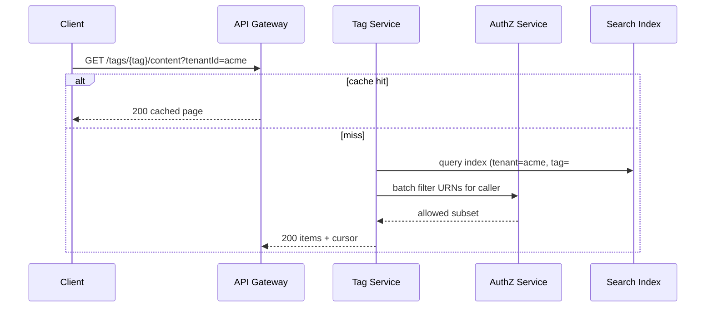

# Cross‑Product Tagging — Part 1: API Design

We expose a product‑agnostic API using **EntityRef URNs** and free‑form tags. All write APIs accept an **Idempotency‑Key**. Responses include minimal **entity summaries** (title/url) via hydration or from the search index cache.

---

## Resource Identifiers

- **EntityRef (URN)**: `urn:atl:{tenantId}:{product}:{entityType}:{externalEntityId}`  
  - Example: `urn:atl:acme:jira:issue:JRA-123`

- **Tag Name Rules**
  - Free‑form, canonicalized to `normalized_name` (lowercase, single spaces, trim).  
  - Display name preserved as first‑seen capitalization.
  - Aliases supported (rename, merge).

---

## Endpoints

### Tags on an Entity

```
PUT    /v1/entities/{urn}/tags            # replace whole set (atomic)
POST   /v1/entities/{urn}/tags            # add one or more
DELETE /v1/entities/{urn}/tags/{tag}      # remove single tag
GET    /v1/entities/{urn}/tags            # list tags on entity
```

**Example — Add tags**

```http
POST /v1/entities/urn:atl:acme:jira:issue:JRA-123/tags
Idempotency-Key: 8c6c...

{ "tags": ["#Project-XYZ", "frontend"] }
```

```json
200 OK
{
  "entity": "urn:atl:acme:jira:issue:JRA-123",
  "tags": [
    {"name":"#project-xyz","displayName":"#Project-XYZ"},
    {"name":"frontend","displayName":"frontend"}
  ],
  "updatedAt":"2025-08-25T10:10:00Z"
}
```

### Browse by Tag

```
GET /v1/tags/{tag}/content?tenantId=acme&product=&type=&sort=recent&limit=50&cursor=...
```

- Returns paginated **entities** that carry the tag; **AuthZ‑filtered** for caller.

**Response**

```json
{
  "tag":"#project-xyz",
  "tenantId":"acme",
  "items":[
    {"urn":"urn:atl:acme:jira:issue:JRA-123","title":"Fix login","product":"jira","type":"issue","url":"...","updatedAt":"..."},
    {"urn":"urn:atl:acme:confluence:page:98765","title":"Auth spec","product":"confluence","type":"page","url":"..."}
  ],
  "nextCursor":"rank:..."
}
```

### Popular Tags (Top‑K)

```
GET /v1/tags/popular?scope=global|tenant:acme&window=1d|7d|30d|all&limit=10
```

**Response**
```json
{"items":[{"tag":"#project-xyz","count":14231},{"tag":"infra","count":9981}],"window":"7d","scope":"global"}
```

### Tag Management (optional)

```
PATCH  /v1/tags/{tag}/rename     # rename canonical (merges counts, adds alias)
POST   /v1/tags/{tag}/aliases    # add alias
DELETE /v1/tags/{tag}/aliases/{alias}
GET    /v1/tags/suggest?q=proj&tenantId=acme&limit=10
```

---

## Sequences

### Add Tags to Entity

```mermaid
sequenceDiagram
  participant C as Client
  participant GW as API Gateway
  participant T as Tag Service
  participant DB as Postgres
  participant OB as Outbox
  participant BUS as Event Bus

  C->>GW: POST /entities/{urn}/tags {tags}
  GW->>T: forward (JWT with tenant, user)
  T->>DB: BEGIN; upsert tags; upsert taggings; commit
  T->>OB: write TaggingAdded events (tx outbox)
  T-->>C: 200 updated tag set
  OB->>BUS: publish TaggingAdded
```

### Browse by Tag (AuthZ filtered)



---

## Errors & Policies

- `400` invalid URN or tag format.  
- `404` entity not registered (optional entity registry).  
- `409` idempotency conflict (duplicate request with different body).  
- `403` forbidden (AuthZ).

**Idempotency**: `Idempotency-Key` header stored in Redis for 24h with response body.

**Rate limits**: per user/IP for writes; per tenant for heavy reads.
