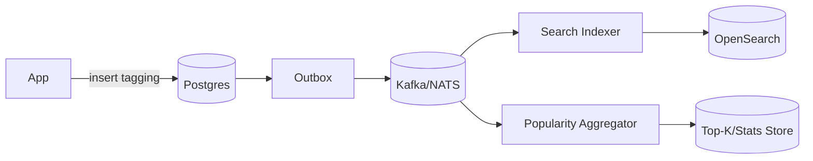

# Cross‑Product Tagging — Part 2: Data Modeling

**System of Record:** PostgreSQL (normalized), with **Search Index** (OpenSearch/ES) for fast cross‑product reads.  
All tables are **multi‑tenant** (partition key `tenant_id`).

---

## Relational Schema (PostgreSQL)

```sql
-- Tenants (customers)
CREATE TABLE tenants (
  id         TEXT PRIMARY KEY,  -- e.g., 'acme'
  name       TEXT NOT NULL,
  created_at TIMESTAMPTZ NOT NULL DEFAULT now()
);

-- Catalog of products and entity types (extensible, no schema changes for new types)
CREATE TABLE product_types (
  id         BIGSERIAL PRIMARY KEY,
  product    TEXT NOT NULL,     -- 'jira','confluence','bitbucket',...
  entity_type TEXT NOT NULL,    -- 'issue','page','pull_request',...
  UNIQUE (product, entity_type)
);

-- Canonical entity registry (product-agnostic reference)
CREATE TABLE entities (
  id            BIGSERIAL PRIMARY KEY,
  tenant_id     TEXT NOT NULL REFERENCES tenants(id) ON DELETE CASCADE,
  product       TEXT NOT NULL,
  entity_type   TEXT NOT NULL,
  external_id   TEXT NOT NULL,              -- e.g., 'JRA-123', 'PR-456'
  urn           TEXT NOT NULL UNIQUE,       -- 'urn:atl:tenant:product:type:external'
  title         TEXT,                       -- optional summary for caching
  url           TEXT,                       -- deep link for UI
  created_at    TIMESTAMPTZ NOT NULL DEFAULT now(),
  updated_at    TIMESTAMPTZ NOT NULL DEFAULT now(),
  UNIQUE (tenant_id, product, entity_type, external_id)
);

-- Tags (free-form; canonicalized)
CREATE TABLE tags (
  id             BIGSERIAL PRIMARY KEY,
  tenant_id      TEXT NOT NULL REFERENCES tenants(id) ON DELETE CASCADE,
  normalized_name CITEXT NOT NULL,          -- lowercase canonical (case-insensitive)
  display_name   TEXT NOT NULL,
  created_by     TEXT,
  created_at     TIMESTAMPTZ NOT NULL DEFAULT now(),
  UNIQUE (tenant_id, normalized_name)
);

-- Optional aliases and renames
CREATE TABLE tag_aliases (
  tenant_id      TEXT NOT NULL REFERENCES tenants(id) ON DELETE CASCADE,
  alias_name     CITEXT NOT NULL,           -- points to canonical tag
  tag_id         BIGINT NOT NULL REFERENCES tags(id) ON DELETE CASCADE,
  PRIMARY KEY (tenant_id, alias_name)
);

-- Taggings (association): many-to-many
CREATE TABLE taggings (
  tenant_id    TEXT NOT NULL REFERENCES tenants(id) ON DELETE CASCADE,
  tag_id       BIGINT NOT NULL REFERENCES tags(id) ON DELETE CASCADE,
  entity_id    BIGINT NOT NULL REFERENCES entities(id) ON DELETE CASCADE,
  added_by     TEXT,
  added_at     TIMESTAMPTZ NOT NULL DEFAULT now(),
  PRIMARY KEY (tenant_id, tag_id, entity_id)
);

-- Counters for quick stats (eventually consistent)
CREATE TABLE tag_stats (
  tenant_id    TEXT NOT NULL,
  tag_id       BIGINT NOT NULL,
  window       TEXT NOT NULL,   -- '1d','7d','30d','all'
  count        BIGINT NOT NULL,
  as_of        TIMESTAMPTZ NOT NULL,
  PRIMARY KEY (tenant_id, tag_id, window)
);
```

**Indexes**

```sql
-- Retrieve entities by tag (tenant scoped)
CREATE INDEX idx_taggings_tenant_tag ON taggings(tenant_id, tag_id, entity_id);
-- Popular tags per tenant
CREATE INDEX idx_tag_stats_tenant_window_count ON tag_stats(tenant_id, window, count DESC);
-- Suggest/autocomplete (trigram)
CREATE INDEX idx_tags_name_trgm ON tags USING gin (normalized_name gin_trgm_ops);
```

---

## Search / Analytics Index (OpenSearch/ES)

**Index doc per entity** (denormalized summary), not per tagging:
```json
{
  "urn": "urn:atl:acme:jira:issue:JRA-123",
  "tenantId": "acme",
  "product": "jira",
  "type": "issue",
  "title": "Fix login",
  "url": "https://...",
  "tags": ["#project-xyz","frontend"],
  "updatedAt": "2025-08-25T10:10:00Z"
}
```
- Query by `tenantId` + `tags contains <tag>`; filter by product/type; paginate.

**Why store in ES?**
- Natural inverted index over tags; aggregations for counts; relevance & full‑text if needed.

---

## Eventing & Outbox



- **Outbox pattern** ensures exactly‑once publication.  
- Consumers update **ES** (document upsert) and **counters** (increment/decrement).

---

## Alternatives & Trade‑offs

- **Single‑table NoSQL (DynamoDB)**: fast at scale; complex secondary index design for flexible queries.  
- **Graph DB**: overkill here; relations are simple.  
- **Only ES, no Postgres**: risky as system of record; ES eventual consistency & no transactions.
