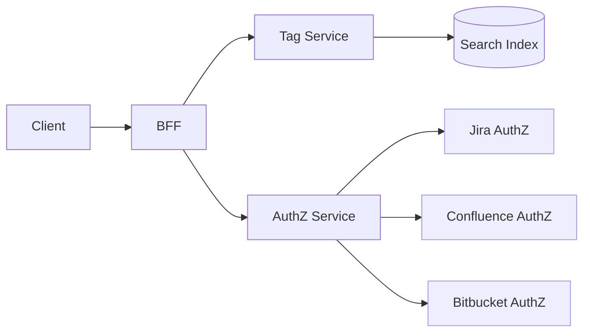
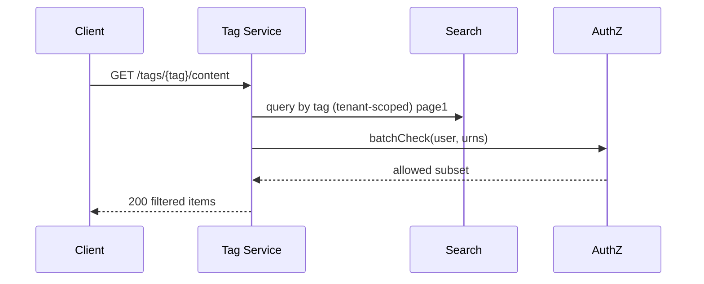

# Cross‑Product Tagging — Part 5: Introducing Permissions

Search results and tag dashboards must respect **user permissions** across products.

---

## Requirements

- Users should only see entities they are **authorized** to view.  
- Popular tags may be **global** (privacy review!) or **tenant/user‑filtered**.  
- Products have **different ACL models** → need a **pluggable** AuthZ layer.

---

## Architecture

- **AuthZ Service** provides a **batch authorize** API per product to check many URNs at once.  
- Tag Service calls AuthZ for **filtering** result sets (prefer near the data to limit egress).  
- Cache **positive** checks short‑term (e.g., 60s) with `(userId, urn)` key; invalidate on membership events if available.

---

## Browse by Tag with AuthZ

**Optimization**: group URNs by product and call the product’s batch endpoint in parallel.

---

## Popular Tags & Permissions

- **Global dashboard**: aggregate counts across all tenants → privacy risk. Consider:  
  - Only show **aggregated counts** with no tenant names.  
  - Opt‑out or compute only on **public tags**.  
  - Or restrict dashboard to **per‑tenant** view by default.

- **Per‑user popular tags**: compute top‑K **after AuthZ** (expensive). Options:  
  1) **Sampled** evaluation: estimate per‑user by sampling entities behind each tag.  
  2) **Precompute per‑group/team** where ACLs align, not per user.  
  3) Show **global/tenant** popular tags as hints, apply AuthZ when clicking into tag page.

---

## Data Model Notes

- No ACLs stored in Tag DB; keep source of truth in products.  
- Store optional **visibility hints** (e.g., repo/project/page space) to pre‑filter AuthZ calls.  
- Maintain **subject→scope** caches (user→projects/spaces) to fast‑reject many URNs.

---

## Failure Modes

- AuthZ service slow/unavailable → degrade by returning **empty** or **partial** results with banner.  
- Product ACL change lag → short TTL caches; force refresh on 403 storms.  
- Large result sets → paginate before AuthZ, **then** fetch next page with fresh checks.
