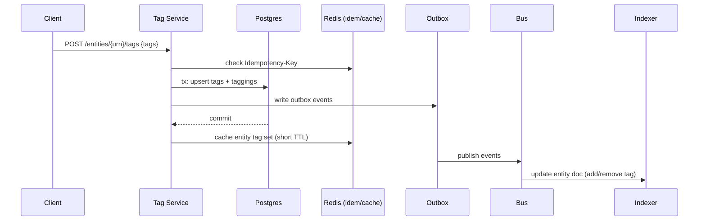

# Cross‑Product Tagging — Part 4: Scaling Remaining APIs

Main hot path: **Browse content by tag** (tenant‑scoped, product filters, pagination), plus **tag write** paths.

---

## Read Path Options

### Option 1 — Postgres Join + Hydration (Baseline)

- Query `tags` → `taggings` (tenant, tag) → `entities` (entity summaries).  
- Hydrate missing summaries from product backends as needed.

**Pros**: Simple, strong consistency.  
**Cons**: Joins + hydration RPCs can be slow at scale; limited full‑text.

### Option 2 — **Search Index** (Recommended)

- Maintain ES index per **entity** with embedded tag array.  
- Query by `tenantId` + `tags:tag` + filters; return summaries directly.

**Pros**: Inverted index ❤️; fast paginate/filter; decouples from products.  
**Cons**: Eventual consistency; requires indexer pipeline.

### Option 3 — Tag‑centric Chunks

- Materialize documents `(tenantId, tagId, chunkN)` each containing ~1k entity URNs sorted by recency.  
- Read is one/few doc fetches per page.

**Pros**: Very fast inexpensive reads.  
**Cons**: Complex maintenance on add/remove; compaction needed.

**Recommendation**: **Option 2** for generality + performance; keep **Option 1** as fallback / source of truth.

---

## Write Path (Idempotent & Consistent)

**Conflict control**: unique `(tenant_id, tag_id, entity_id)` prevents duplicates.  
**Rename/Merge**: add alias; migrate taggings async; indexer updates docs.

---

## Caching & Pagination

- **Keyset pagination** using `(entity.updatedAt, entity.id)` or index sort key.  
- **Cache** first page per tag/tenant in Redis (30–60s TTL).  
- **ETag** for `GET /tags/{tag}/content` responses.  
- **CDN** for public/anon views (if used).

---

## Multi‑Region & Consistency

- **Writes** to a single primary region (or multi‑region DB later).  
- **Read replicas** + **ES clusters** in multiple regions; latency‑based routing.  
- **Read‑your‑write**: route the writer’s next read to the primary (TTL) or use ES op‑refresh policy if needed.

---

## Capacity & Limits

- **Hot tags**: per‑tag throughput caps; degrade with backoff.  
- **Size**: tag per entity cap (e.g., 50) to bound payloads.  
- **Index**: keep entity doc small; avoid huge tag arrays; soft limit & split if needed.
