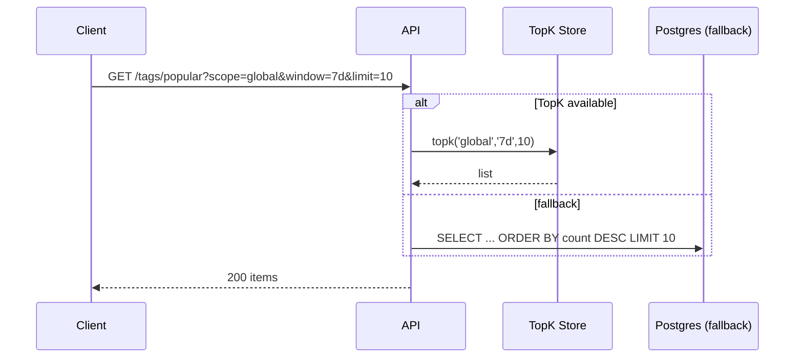

# Cross‑Product Tagging — Part 3: Scaling the Popular Tags API

We need fast **Top‑10 tags** globally and per tenant, with optional time windows (`1d`, `7d`, `30d`, `all`).

---

## Approaches

### A) Exact Counters in DB + Periodic Query (Simple, Baseline)

- Maintain `tag_stats(window)` in Postgres by incrementing on add and decrementing on remove.  
- A scheduled job recomputes/compacts per window daily/hourly; `GET /tags/popular` is a single indexed query.

**Pros**: Simple, exact for `all` and near‑exact for windows.  
**Cons**: Write amplification; heavy tenants can create hot rows; windowing logic is batchy (not instant).

### B) Streaming Heavy‑Hitters (Approximate) ✅ *Preferred for global real‑time*

- Stream `TaggingAdded/Removed` to an **Aggregator** (Kafka Streams/Flink).  
- Maintain **per‑scope** **Count‑Min Sketch + heap** or use **Redis TopK** structure.
- Periodically snapshot to `tag_stats` for durability.

**Pros**: Sub‑ms query for top‑K, handles very high throughput, memory bounded.  
**Cons**: Approximate (false positives, small error). Extra infra.

### C) Search Aggregations (Elasticsearch Terms Agg) 

- Query ES: `terms` aggregation on `tags` filtered by `tenantId`/time.  
**Pros**: Zero extra infra if ES already in use; supports time filtering.  
**Cons**: Costly at large scale; shard size tuning; slower than dedicated Top‑K store.

---

## Recommended Hybrid

- **Per‑tenant**: Approach **A** (exact) is fine and cheap.  
- **Global**: Approach **B** for **real‑time**, backed by periodic snapshots to DB.  
- **Ad‑hoc** (filters/time ranges): Approach **C** on ES for non‑hot paths.

---

## Data Flow

```mermaid
sequenceDiagram
  participant API as Tag Service
  participant OB as Outbox
  participant BUS as Kafka/NATS
  participant AGG as TopK Aggregator
  participant RT as Redis TopK/RocksDB
  participant DB as Postgres (tag_stats)

  API->>OB: write TaggingAdded/Removed
  OB->>BUS: publish
  BUS->>AGG: consume stream
  AGG->>RT: update TopK structures (per scope/window)
  Note over RT: O(1) amortized; approx heavy hitters
  par Periodic snapshot
    AGG->>DB: UPSERT tag_stats(window='all' & rolling windows)
  end
```

**Query Path**



---

## Time Windows

- Use tumbling buckets: e.g., per‑hour counts; **7d** = sum of last 168 buckets.  
- Aggregator maintains rolling sums in memory; snapshots persisted.

---

## Pros/Cons Summary

| Approach | Accuracy | Latency | Cost | Complexity | Fit |
|---|---|---|---|---|---|
| DB counters | Exact (all), near‑exact (windows) | Low | Low | Low | Per‑tenant |
| Streaming Top‑K | Approx | **Very low** | Med | Med | **Global real‑time** |
| ES agg | Exact | Med/High | High | Low/Med | Ad‑hoc analytics |

