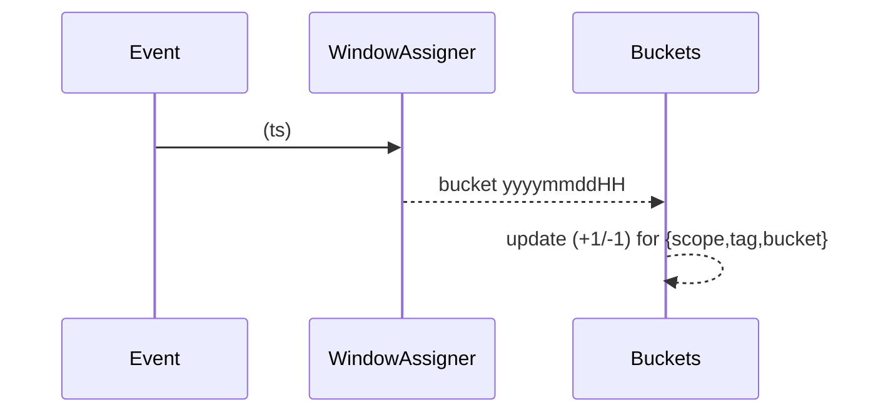
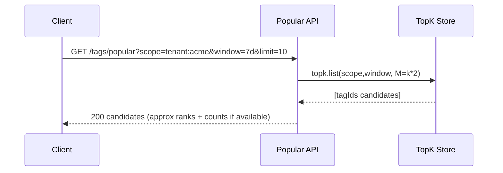
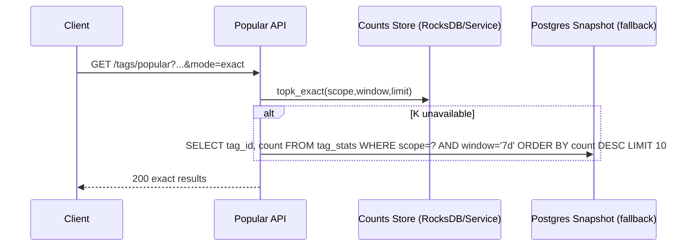
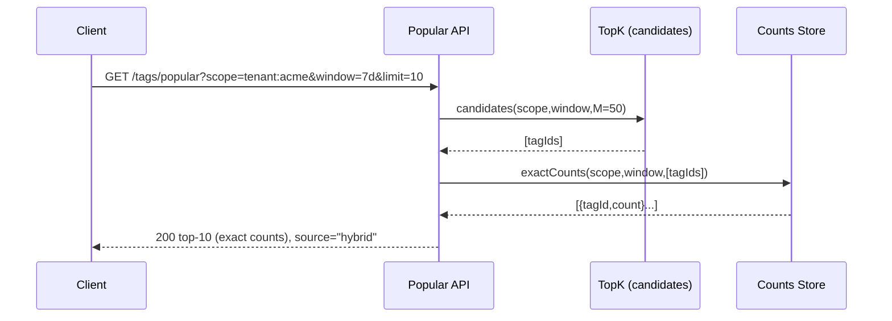

# Streaming Top‑K for Popular Tags — Deep Dive

This document focuses on a **streaming, near–real‑time** solution for the **Popular Tags** dashboard across multi‑product, multi‑tenant content. It explains how the parts fit together to produce **fast** and **fresh** results, and it includes a **hybrid approach** that combines **approximate heavy‑hitters** with **exact counts**.

We include algorithm choices, state layout, time‑windowing, idempotency, APIs, and operations. Diagrams at each stage.

---

## 0) Goals & Constraints

- **Latency**: p95 query < **50–100 ms** from nearest region; freshness **< 2–5 s** end‑to‑end.
- **Scale**: 10^7–10^9 tagging events/day; high tag cardinality; high skew (hot tags).
- **Scopes**: `global`, `tenant:{tenantId}` (optionally `product`, `type`).
- **Windows**: `1d`, `7d`, `30d`, `all`.
- **Correctness**: Top‑K must be **accurate enough** for UI; exact ranking available via **hybrid** path.
- **Writes**: idempotent; handle **add/remove** tag events, **rename/merge**, replay, backfill.

---

## 1) Architecture (Data Flow)

```mermaid
flowchart LR
  subgraph Producers
    TagSvc[Tag Service (Outbox)] --> EVT[TaggingEvents Topic]
  end

  subgraph StreamProc
    EVT --> DEDUP[Dedup/Ordering]
    DEDUP --> ROUTE[Scope/Window Router]
    ROUTE --> HH[Heavy-Hitter Layer (TopK candidates)]
    ROUTE --> CNT[Exact Count Layer (KTable/State Store)]
    HH --> SNAP[Snapshotter (optional)]
    CNT --> SNAP
  end

  subgraph Stores
    TKS[(TopK Store: Redis TopK / RocksDB SpaceSaving)]
    KVS[(Counts Store: RocksDB/SQL buckets)]
    DB[(Postgres tag_stats snapshots)]
  end

  HH -->|update| TKS
  CNT -->|update| KVS
  SNAP --> DB

  subgraph Serving
    API[Popular Tags API]
    API -->|Approx| TKS
    API -->|Exact by Candidate| KVS
    API -->|Fallback| DB
  end
```

**Key idea:**

- Maintain **two layers**:
  1. **Heavy‑Hitter (HH)**: very fast, approximate **candidate** discovery for each `(scope, window)`.
  2. **Exact Count (CNT)**: authoritative counts (per tag, per window).

The API composes them for **hybrid results**: _get candidates fast → rank with exact counts_.

---

## 2) Event Model

```json
{
  "eventId": "01J8Z...",
  "ts": "2025-08-26T12:01:23.450Z",
  "tenantId": "acme",
  "product": "jira",
  "entityType": "issue",
  "entityExternalId": "JRA-123",
  "entityUrn": "urn:atl:acme:jira:issue:JRA-123",
  "tag": "#project-xyz",
  "tagId": 718223, // canonical tag id
  "op": "ADD" // or "REMOVE"
}
```

- Emitted by **Tag Service** using **Outbox** (exactly‑once to the topic).
- **Partition key**: hash of `(scopeKey, tagId)` where `scopeKey` could be `"global"` or `"tenant:acme"`.
- **Ordering**: per partition; reorders handled by aggregators over time windows.

---

## 3) Windowing Strategy

We support `all` (lifetime), and rolling windows (`1d`, `7d`, `30d`). To keep memory bounded and updates cheap:

- Use **tumbling time buckets** (e.g., **hourly**) and compute window counts as the **sum of last N buckets**:
  - `1d` = last 24 buckets; `7d` = last 168; `30d` = last 720.
- For **late arrivals**, accept a small lateness tolerance (e.g., 5–10 minutes) and update prior buckets.
- Buckets are keys of the form:  
  `bucketKey = {scope}:{tagId}:{yyyyMMddHH}`



---

## 4) Heavy‑Hitter Layer (Candidates)

Purpose: track **likely top tags** quickly for each `(scope, window)`; the result is a **small candidate set**.

### Options

1. **Redis TopK (HeavyKeeper)**

   - O(1) update per event (`TOPK.INCRBY` not natively supported; use `TOPK.ADD` per occurrence).
   - Returns `TOPK.LIST` and `TOPK.INFO`.
   - **No decrement** support → treats stream as add‑only. For removes, rely on **Exact Count** to re‑rank and filter out stale candidates.

2. **Space‑Saving (Misra‑Gries) in state store (RocksDB)**

   - O(1) amortized; bounded memory per `(scope,window)`.
   - Add‑only; no decrements.
   - Portable (Flink/Kafka Streams).

3. **Count‑Min Sketch + Heap**
   - Supports increments; decrements are **unsafe** (non‑negative sketch).
   - Use for _approximate_ **upper bounds**; still need Exact Count for final ranking.

**Recommendation**: **Space‑Saving or Redis TopK** for candidate discovery (fast & simple), combined with the **Exact Count layer** for correctness under removals.

---

## 5) Exact Count Layer (Authoritative)

Maintain **per‑bucket exact counts** in a state store (RocksDB) and/or in Postgres:

- **Streaming side (recommended)**: KTable keyed by `{scope, tagId, bucket}`; apply `+1/-1`.
- Online query API merges last N buckets at read time (fast with local RocksDB) or pre‑aggregates rolling sums in memory.
- **Snapshot** to Postgres (`tag_stats`) periodically (e.g., every 1–5 minutes) for durability and cold start.

```mermaid
flowchart LR
  EVT[Events] --> AGG[Per-bucket aggregator (+/-)]
  AGG --> RS[(RocksDB KTable)]
  RS --> SUM[Rolling Sum (N buckets)]
  SUM --> APIQ[Counts API (exact)]
  RS --> SNAP[Snapshotter] --> DB[(Postgres tag_stats)]
```

**Benefits**

- Precise handling of **REMOVE**.
- Efficient windowing by summing a **small set of buckets**.

### 5.1 Why RocksDB for Exact Counts

- **Local, embedded state for streams**: RocksDB is the default local state store for Kafka Streams and widely used with Flink. It co‑locates state with the stream task, avoiding network hops for every `+1/-1` and for point lookups during reads, which reduces p95/99 tail latency.
- **Write‑path optimized (LSM‑tree)**: Our workload is append‑heavy small updates to per‑bucket counters. RocksDB turns random writes into sequential I/O via memtables/WAL and compaction, delivering very high write throughput with predictable latency.
- **Fast point reads and prefix scans**: Popular queries touch a small set of keys (last N hourly buckets per `{scope, tagId}`). RocksDB provides low‑latency point reads and efficient prefix iteration when needed; Bloom filters further cut IO for negatives.
- **Bounded memory, large keyspace**: State lives primarily on disk with compression; memory usage is bounded (block cache + memtables). This supports millions of `{scope,tag,bucket}` keys at low cost compared to an in‑memory store.
- **Exactly‑once and recovery**: In stream processors, RocksDB is backed by a Kafka changelog. This enables exactly‑once semantics, fast restore/rebalance, and deterministic recovery after crashes or rescheduling.
- **Windowing friendly lifecycle**: Hourly buckets age out naturally. TTLs/delete‑range plus compaction reclaim space without expensive table‑wide VACUUMs.
- **Operational simplicity at scale**: Local NVMe + RocksDB means the hot path has no external dependency. Snapshots/backups are straightforward, and periodic exports to Postgres provide durability and cold‑start serving.
- **Why not Postgres for the hot path?** High QPS of tiny upserts can induce lock contention, bloat, and higher tail latency. It’s excellent as the snapshot store and for batch analytics, not for per‑event counter mutation at this scale.
- **Why not Redis for exact counts?** It’s great for Top‑K candidates, but keeping exact per‑bucket counts in Redis is memory‑heavy and introduces persistence/replication complexity. For exact counts we prefer on‑disk, locally attached state with changelog durability.

---

## 6) Serving Paths (Approx / Exact / Hybrid)

### 6.1 Approximate Path (fastest)



- **Pros**: Sub‑ms read; great for **live dashboards**.
- **Cons**: May include **false positives** or stale items; counts are approximate or absent.

### 6.2 Exact Path (DB / State Store)



- If KTable service maintains a **per-scope min‑heap** (updated on every count change), exact top‑K is O(1) read.
- Otherwise, keep a **candidate pool** (from TopK) and rank them exactly.

### 6.3 **Hybrid Path (Recommended)**

1. Retrieve **M candidates** from **TopK** (M ≈ 2–5× k).
2. Fetch **exact counts** for these candidates from **Counts Store** (sum last N buckets).
3. **Sort and return top‑k** with exact counts; include **freshness** and **source** metadata.
4. Cache result for **1–5s** per `(scope, window)`.



- **Why this works**: computation over a **tiny set** (dozens), yet results are **exact** and **fresh**.

---

## 7) State & Keys

### Scoping Keys

- **scope**: `global` or `tenant:{tenantId}` (optionally add `:product` or `:type` if needed).
- **window**: `all`, `1d`, `7d`, `30d`.
- **bucket**: `yyyyMMddHH` (hourly).

**TopK Key**: `topk:{scope}:{window}`  
**Counts Keys** (RocksDB / Redis Hash): `cnt:{scope}:{tagId}:{bucket}`  
**Rolling Sums Cache**: `sum:{scope}:{window}:{tagId}` (optional derived cache)

---

## 8) Handling REMOVE, Rename, Merge, Replay

- **REMOVE** reduces per‑bucket count in **Counts Store** (authoritative).
- **HH/TopK** (add‑only) may still include an item briefly; **hybrid** step filters it out as count may be ≤ 0.
- **Rename/Merge**: create alias mapping; aggregator rewrites to **canonical `tagId`**. For merges, reassign historical counts during maintenance; forward events use the canonical id.
- **Replay/Backfill**: events include `eventId` and **idempotency key**; stream processor is **EOS** (exactly‑once semantics) with a **dedup store** per partition.
- **Late events** (< lateness threshold): adjust the affected bucket and update heaps; **older than threshold** → batch reconcile job adjusts DB snapshot.

---

## 9) API Contract (Popular Tags)

```http
GET /v1/tags/popular?scope=global|tenant:acme&window=1d|7d|30d|all&limit=10&mode=hybrid|approx|exact
```

**Response**

```json
{
  "scope": "tenant:acme",
  "window": "7d",
  "mode": "hybrid",
  "asOf": "2025-08-26T12:11:00Z",
  "items": [
    { "tag": "#project-xyz", "tagId": 718223, "count": 14231 },
    { "tag": "frontend", "tagId": 991, "count": 9981 }
  ],
  "debug": { "candidateSet": 50, "freshnessMs": 1800 }
}
```

**Caching**: CDN/Redis cache by `(scope,window,mode,limit)` for **1–5 s**; purge on big shifts optional.

---

## 10) Operational Concerns

### Idempotency & Exactly‑Once

- **Outbox** from Tag Service.
- Streaming engine with **EOS**: Kafka Streams (`processing.guarantee=exactly_once_v2`) or Flink two‑phase commit sinks.
- Deduplicate by `(eventId)` in a compacted state store.

### Backpressure & Burst Control

- Batch updates to TopK/Counts (micro‑batch) when needed.
- Use **linger.ms**/**batch.size** to smooth producer; **max.poll.interval.ms** to keep consumers healthy.
- Shed load by reducing **M (candidate size)** during stress while keeping correctness via exact path if requested.

### Multi‑Region

- Regional streams and TopK stores per region; **aggregate** regionals for global scope asynchronously or route global reads to a **primary region**.
- For per‑tenant scope, stick to tenant’s **home region** for writes & reads (region affinity).

### Observability

- **Metrics**: end‑to‑end latency, consumer lag, TopK update QPS, size of candidate set, error rate, heap churn, RocksDB compaction.
- **Dashboards**: per scope/window hit ratio; mode usage (approx vs hybrid vs exact).
- **Alarms**: stream lag > threshold; drift between exact & approx; TopK eviction rate spikes.

---

## 11) Storage & Capacity

- **TopK** memory per `(scope,window)` is O(k) (e.g., k=100 with slack → few KB).
- **Counts**: buckets per `(scope,tag)` per hour; rollups nightly to trim old buckets.
- **DB snapshots**: store periodic `tag_stats(scope, window, count, as_of)`; partition by `scope` and `window`.

---

## 12) Algorithms — Quick Primer

### Space‑Saving (Misra‑Gries variant)

- Maintains K counters; on unseen item when full, **replace min** with new item and set count=min+1.
- Overestimates by at most `N/K`. Good for streaming heavy‑hitters.
- Add‑only; use exact counts for final ranking.

### Redis TopK (HeavyKeeper‑like)

- Probabilistic decay + counters across multiple hashes; provides `TOPK.LIST`.
- No decrement; same hybrid caveat.

### Count‑Min Sketch

- Counts via d hash functions and arrays; returns **upper bound**.
- Susceptible to noise for long tails; decrements not safe. Good as a **filter**.

---

## 13) Hybrid Correctness & SLA

- **Freshness** governed by stream lag + windowing lateness; target < 2s.
- **Correctness**: Hybrid guarantees **exact counts** and **correct ordering** for returned top‑k, because candidates are re‑ranked by exact sum of buckets.
- If TopK misses a true heavy hitter (rare if M sufficiently > k), raise **M** adaptively or merge with **periodic exact top‑k recompute** from KTable (off the hot path).

---

## 14) Failure Modes & Fallbacks

- **TopK store down** → API switches to **exact** path (KTable heap or DB snapshot).
- **Counts store unavailable** → return **approx** with banner; log SLA breach.
- **Stream lag** → expose `asOf` timestamp; degrade cache TTL; optionally pin to **DB snapshot** for stability.
- **Clock skew** → rely on event time; assign buckets by event timestamp; cap lateness.

---

## 15) Pros & Cons

| Approach                 | Pros                       | Cons                              | Use When                   |
| ------------------------ | -------------------------- | --------------------------------- | -------------------------- |
| Approx only (TopK)       | Fastest, cheap reads       | Inexact, no decrements            | Live ticker, low-stakes UI |
| Exact only (DB/KTable)   | Accurate                   | Potentially expensive at scale    | Small scope, low QPS       |
| **Hybrid (Recommended)** | Fast **and** exact results | Slightly more complex             | Popular tags dashboard     |
| Redis TopK               | Simple to run              | No decrement                      | External cache acceptable  |
| Space-Saving (in-stream) | Portable, low mem          | Add-only                          | Self-hosted stream proc    |
| CMS+Heap                 | Increment-friendly         | Overestimates; no safe decrements | Filter then verify         |

---

## 16) Pseudo‑Code (Hybrid Serve)

```python
def get_popular_tags(scope, window, k, mode='hybrid'):
    if mode == 'approx':
        cand = topk_store.list(scope, window, M=k*3)
        return [{"tagId":t, "approx": True} for t in cand[:k]]

    if mode == 'exact':
        return counts_service.topk_exact(scope, window, k)

    # hybrid
    cand = topk_store.list(scope, window, M=k*3)  # fast
    counts = counts_service.batch_counts(scope, window, cand)  # exact sums of buckets
    ranked = sorted(counts, key=lambda x: x['count'], reverse=True)
    return ranked[:k]
```

---

## 17) Security & Privacy

- Popular tags may leak interests; prefer **per‑tenant** scope by default.
- If global scope shown, display **aggregated counts** only; no tenant names.
- Rate‑limit and audit the API; redact PII in events.

---

## 18) Checklist for Implementation

- [ ] Define topics, event schemas, outbox publishing.
- [ ] Choose **TopK engine** (Redis TopK vs in‑stream Space‑Saving).
- [ ] Implement **per‑bucket counts** with KTable + RocksDB; rolling sums.
- [ ] API modes: `approx | exact | hybrid`; short TTL caches.
- [ ] Snapshots to DB; scheduled reconcile & drift monitor.
- [ ] Dashboards: lag, freshness, drift, heap size, error rates.

---

_End of deep dive._
