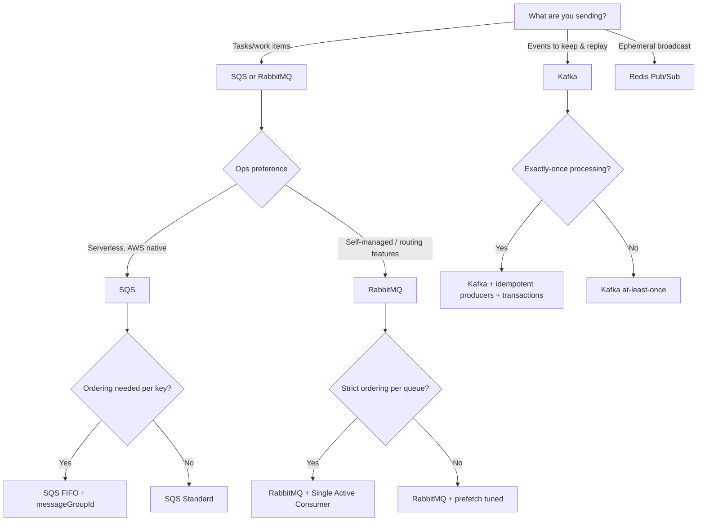

# RabbitMQ vs AWS SQS vs Apache Kafka (+ Redis Pub/Sub) — How to Choose

**Context:** You mentioned you already know Kafka well; this guide focuses on how it contrasts with **RabbitMQ**, **AWS SQS**, and now **Redis Pub/Sub**, with concrete selection criteria and real‑world designs (including a web crawler).

---

## TL;DR — quick picks

- **Pick AWS SQS** for a *managed work queue* with minimal ops, native AWS integrations (Lambda, IAM, CloudWatch), and at‑least‑once delivery (Standard) or strict ordering per **message group** (FIFO). Use for **task queues** (image/video processing, crawl workers, background jobs) and **fan‑out** via **SNS → SQS** when you need multiple consumers.
- **Pick RabbitMQ** for a *message broker* with rich **routing** (direct/topic/headers exchanges), **push‑based consumers**, **TTL**, priorities, **dead‑lettering**, and **low‑latency RPC/command** patterns. Great for **microservice command→handler**, **real‑time notifications**, **per‑tenant routing**, and on‑prem/hybrid. Use **Quorum Queues** for HA. Consider **Streams** if you want Kafka‑like log semantics at moderate scale.
- **Pick Kafka** when your messages are **events** you want to *retain and replay*, feed into stream processing (Kafka Streams/Flink/Spark), and scale to very high throughput. Perfect for **CDC**, **analytics pipelines**, **event‑sourcing**, **telemetry**, and **log aggregation**. Use **transactions + idempotent producers** for end‑to‑end exactly‑once *processing*.
- **Pick Redis Pub/Sub** for **ultra‑low‑latency, ephemeral broadcast** inside your app boundary: **cache invalidation**, **presence**/**status fanout**, **in‑process notifications**, **UI live updates**, and **simple chat**. It’s **not a queue**: no persistence, no replay, no consumer groups. For durability with Redis, use **Redis Streams**, not Pub/Sub.

> Rule of thumb: **Queue a task? → SQS or RabbitMQ.** **Record a fact? → Kafka.** **Broadcast a transient signal? → Redis Pub/Sub.**

---

## Mental model: Queue vs Log vs Broadcast

| Concept | RabbitMQ | AWS SQS | Apache Kafka | Redis Pub/Sub |
|---|---|---|---|---|
| Primary abstraction | **Broker + queues** with **exchanges** that route to queues | **Managed queues** (Standard/FIFO) | **Distributed commit log** (topics/partitions) | **In‑memory channels** (broadcast) |
| Consumption | **Push** (`basic.consume`) w/ prefetch backpressure | **Poll** (long/short) or Lambda event mapping | **Pull** (`poll()`), offsets per consumer group | **Push** to connected subscribers |
| Delivery semantics | At‑least‑once with acks; DLX/TTL; **Quorum** supports delivery limit | Standard: at‑least‑once; FIFO: strict order per group + dedupe | At‑least‑once; **EOS** via idempotent producers + transactions | **At‑most‑once** (no persistence); only online subscribers receive |
| Ordering | Per‑queue best‑effort; **Single‑Active‑Consumer** for strict order | Standard: no order; FIFO: strict per group | **Per‑partition** | Per connection/channel often ordered on a single node; **no cross‑cluster/order guarantees** |
| Retention & replay | Remove on ack (classic queues). **Streams** retain by time/size | Retention up to **14 days**; deleted after ack | Time/size retention; compaction; replay from offsets | **None** (ephemeral broadcast) |
| Ops model | Self‑managed or **Amazon MQ** | **Fully managed/serverless** | Self‑managed or **Amazon MSK/Confluent** | Runs on your **Redis** (self‑managed or managed) |
| Best at | Task dispatch, routing, RPC | Elastic work queues, serverless jobs | Event hub, analytics, CDC, event‑sourcing | Instant, transient signals and UI fanout |

---

## Where **Redis Pub/Sub** fits (and where it doesn’t)

### Use it for (sweet spots)
- **Cache invalidation / config change broadcast** to app nodes.
- **Live updates** to web/mobile clients (via a gateway/websocket tier).
- **Presence / typing indicators / game lobby status** where occasional loss is tolerable.
- **Simple chat** where *online‑only* delivery is fine (no history), or paired with a DB for history.
- **In‑cluster control signals** (e.g., “start job”, “rotate logs”) where you *also* persist critical state elsewhere.

### Avoid or pair with something else when you need
- **Durability / replay / DLQ / exactly‑once** → choose **Kafka** (events) or **SQS/RabbitMQ** (tasks).  
- **Consumer groups & backpressure** → **RabbitMQ** (prefetch/push) or **SQS** (poll + visibility timeout).  
- **Strict ordering across shards/regions** → **SQS FIFO**, **RabbitMQ SAC**, or **Kafka** per partition.  
- **Large fan‑out with independent teams & data retention** → **Kafka**.

> If you like Redis but need durability and consumer groups, look at **Redis Streams** (not Pub/Sub). Streams give you an append‑only log, IDs, consumer groups, and replay—much closer to Kafka-lite/RabbitMQ‑Streams semantics.

### Real‑world examples for Redis Pub/Sub
- **Multi‑node cache invalidation:** Service updates product 123 → publish `invalidate:product:123` → web/API workers flush their local caches instantly.
- **Live scoreboard / presence:** Game server publishes `room:alpha:score` updates to connected spectators; occasional loss is acceptable.
- **Lightweight notifications bus:** Admin toggles “maintenance mode” → broadcast to gateways to display banner in UI.

---

## When to choose what — decision guide

### Choose **SQS** if you need…
- **Zero ops** managed queue with **serverless** consumption (Lambda) and fast autoscaling.
- **Task/work queues** where each message is a *unit of work* (process and delete).
- **Visibility timeout** and **partial batch failure** handling to retry only failed items.
- **Strict ordering with fan‑out** → **FIFO + `messageGroupId`**; for multi‑subscriber fan‑out, publish to **SNS** and subscribe SQS queues.
- **Bursting** to very high throughputs without managing brokers.

### Choose **RabbitMQ** if you need…
- **Rich routing** (direct/topic/headers), **priorities**, per‑queue/per‑message **TTL**, **DLX**, **push** delivery, and **prefetch** backpressure.
- **Low latency** command/RPC, **per‑tenant** routing, or **fine‑grained** control.
- **High availability** with **Quorum Queues** (Raft), plus **delivery limits** to shunt poison messages.
- **Streams** API when you want log‑like consumption with offsets but don’t need Kafka’s scale.

### Choose **Kafka** if you need…
- **Durable event log** with long retention, **replay**, and **multiple independent consumers**.
- **Stream processing** (Kafka Streams/Flink/Spark), **CDC**, **audit trails**, **event‑sourcing**.
- **Per‑partition ordering** and **idempotent/transactional** semantics for exactly‑once *processing*.

### Choose **Redis Pub/Sub** if you need…
- **Sub‑millisecond broadcast** to online consumers, **no persistence**, and **simple fan‑out** within a service boundary.
- You can **tolerate loss** (e.g., user presence, ephemeral notifications).
- You already operate Redis and want a **lightweight in‑memory signal bus**.

---

## Architecture patterns & real‑world examples

### 1) **Web crawler** (which queue and why?)

**Pick SQS** for the crawl *frontier/work queue.*  
- **Serverless scaling** using Lambda or containers (ECS/EKS) pulling from SQS; no broker ops.  
- **Visibility timeout** lets a worker “lease” a URL; if it crashes, the message reappears for retry. Extend visibility when fetch/parse takes longer.  
- **DLQ** for poison URLs (e.g., 5xx loops).  
- **Politeness/ordering:** With **FIFO**, set `messageGroupId = host` to guarantee *per‑host* order and cap concurrency per host. Use many groups for parallelism across hosts.  
- **Fan‑out:** **SNS → SQS** to fan out crawl results to downstream processors (indexer, link extractor, analytics).  
- Optional: publish normalized page events to **Kafka** for replay/analytics.

**When RabbitMQ instead?**  
- On‑prem/edge; want **push‑based** worker dispatch, **prefetch** backpressure, **topic routing** to different parsers (HTML/PDF/API). Use **Quorum Queues** and **delivery limits**.

**When Redis Pub/Sub?**  
- **Never as the main frontier** (no durability/replay). But useful **inside workers** to broadcast **rate‑limit tokens**, **per‑host cooldown signals**, or **cache invalidations** in your crawl service layer.

**When Kafka?**  
- To treat **crawled content** and **extracted links** as events for **replayable** enrichment pipelines (Flink/Spark/Streams).

---

### 2) **Payments / orders**
- **SQS FIFO** with `messageGroupId = orderId` for strict sequence (authorize → capture → refund).  
- **RabbitMQ** with **Single‑Active‑Consumer** per order queue for strict sequencing and low‑latency sync RPC to APIs.  
- **Kafka** as the **system of record** for order events with compaction; use **transactions** for exactly‑once processing into downstream states (ledger, projections).  
- **Redis Pub/Sub** only for **UI/status pings** (e.g., “payment seen by gateway”), not for state changes.

### 3) **IoT telemetry / product analytics**
- **Kafka/MSK**: ingest millions of events/sec, retain days/weeks, **replay** into many consumers (anomaly detection, batch aggregation).  
- **RabbitMQ**: good for **MQTT ingress** & device commands; can forward to Kafka for analytics.  
- **SQS**: fine for asynchronous job fan‑out (e.g., per‑device ML scoring tasks).  
- **Redis Pub/Sub**: device **presence/heartbeat** to gateway nodes (ephemeral).

### 4) **Email/notification service**
- **RabbitMQ**: exchange routes to email/SMS/push queues with per‑channel TTL/priority.  
- **SQS + SNS**: SNS topic per notification class; SQS queues per channel; Lambda workers for senders; DLQs per channel.  
- **Kafka**: notifications event log feeding senders + analytics.  
- **Redis Pub/Sub**: live **in‑app** notification banners for **online** users; durable sending still handled by SQS/RabbitMQ/Kafka.

---

## Practical constraints to keep in mind

### SQS
- **Message size:** up to **1 MiB**. For larger payloads (to ~2 GiB), use the **SQS Extended Client** to offload bodies to S3.  
- **Ordering:** **FIFO** gives strict order **per `messageGroupId`**; throughput per group is serialized—use many groups.  
- **Retention & visibility:** retention up to **14 days**; **visibility timeout** up to **12 hours** with extend‑in‑flight.  
- **Lambda integration:** supports **partial batch response** so only failed records are retried.

### RabbitMQ
- **Prefetch** too high can starve consumers and disturb ordering; tune per workload.  
- Prefer **Quorum Queues** over legacy mirrored queues; set **delivery limits** and DLX.  
- **Streams** provide offset‑based consumption with retention (note: **Amazon MQ for RabbitMQ currently doesn’t support Streams**).

### Kafka
- Partition count drives parallelism and ops cost; choose keys carefully.  
- EOS/transactions add complexity—use when correctness requires it.  
- Modern clusters run **KRaft** (ZooKeeper‑less) for new deployments.

### Redis Pub/Sub
- **Ephemeral**: no persistence, no consumer groups, no DLQ; offline subscribers **miss** messages.  
- **Order**: generally preserved per connection on a single node; **not guaranteed across cluster/shards/failover**.  
- **Scope**: great inside a trust boundary (your VPC/cluster) for fast signals; not an integration backbone.

---

## A practical checklist (score quickly)

1. Need **replay** / long retention → **Kafka**  
2. Need **serverless job** processing, minimal ops → **SQS**  
3. Need **complex routing** or **push** semantics → **RabbitMQ**  
4. Need **strict per‑key order** with simple ops → **SQS FIFO** (or RabbitMQ SAC)  
5. Need **fan‑out to many teams** from the same events → **Kafka** (or SNS→SQS for AWS‑native)  
6. Need **RPC/command** style with low latency → **RabbitMQ**  
7. AWS‑heavy stack, IAM/Lambda/CloudWatch → **SQS** (or MSK if streaming)  
8. Need **exactly‑once processing** across pipelines → **Kafka transactions**  
9. On‑prem/hybrid with AMQP/STOMP/MQTT → **RabbitMQ**  
10. **Ephemeral broadcast** to online users/services → **Redis Pub/Sub**

---

## Mermaid decision flow

---

## Appendix A — Web crawler reference settings

- **SQS Queue**: FIFO; `messageGroupId = host` (or domain shard).  
- **Producer**: Normalize URL; hash to host group; dedupe check before enqueue.  
- **Consumer (Lambda/ECS)**: batch size 1–10; enable **partial batch response**; set **queue visibility timeout** ≥ 6× max fetch time.  
- **Extend leases**: use `ChangeMessageVisibility` when parsing is slow.  
- **DLQ**: redrive after N receives/timeouts.  
- **Fan‑out**: send crawl results to **SNS** → multiple SQS queues (indexing, link extract, ML).  
- **Optional**: publish normalized page events to **Kafka** for replay/analytics.  
- **Redis Pub/Sub (optional, internal)**: broadcast **per‑host cooldown** or **rate‑limit tokens** within a worker pool.

---

## Appendix B — Feature map

| Need | SQS | RabbitMQ | Kafka | Redis Pub/Sub |
|---|---|---|---|---|
| Serverless, low ops | ✅ | ➖ via Amazon MQ | ➖ via MSK/Confluent | ➖ (runs with Redis) |
| Complex routing (topic/headers) | ➖ (use SNS+SQS) | ✅ | ➖ (topics only) | ➖ (channels/patterns only) |
| Task queue semantics | ✅ | ✅ | ⚠️ possible but not ideal | ❌ |
| Per‑key strict order | ✅ (FIFO groups) | ✅ (SAC/per‑queue) | ✅ (per partition) | ⚠️ local only; **no guarantees cluster‑wide** |
| Long retention & replay | ⚠️ (≤ 14 days) | ⚠️ (Streams only) | ✅ | ❌ |
| Exactly‑once processing | ⚠️ (FIFO dedupe) | ➖ | ✅ (transactions) | ❌ |
| High‑volume event hub | ➖ | ⚠️ | ✅ | ❌ |
| Ephemeral broadcast | ⚠️ | ⚠️ | ⚠️ | ✅ |

---

## Sources & further reading (official docs & primers)

- **Redis**
  - Redis Pub/Sub: https://redis.io/docs/latest/develop/pubsub/  
  - Sharded Pub/Sub (Redis 7+): https://redis.io/docs/latest/commands/pubsub-shardchannels/

- **AWS SQS / SNS / Lambda**
  - Message quotas (size **up to 1 MiB**, retention, groups): https://docs.aws.amazon.com/AWSSimpleQueueService/latest/SQSDeveloperGuide/quotas-messages.html  
  - Visibility timeout (max **12h**) & extension: https://docs.aws.amazon.com/AWSSimpleQueueService/latest/SQSDeveloperGuide/best-practices-processing-messages-timely-manner.html  
  - Configure retention & visibility: https://docs.aws.amazon.com/AWSSimpleQueueService/latest/SQSDeveloperGuide/sqs-configure-queue-parameters.html  
  - SNS → SQS fan‑out: https://docs.aws.amazon.com/sns/latest/dg/sns-sqs-as-subscriber.html  
  - Lambda partial‑batch failures: https://docs.aws.amazon.com/prescriptive-guidance/latest/lambda-event-filtering-partial-batch-responses-for-sqs/best-practices-partial-batch-responses.html

- **RabbitMQ**
  - Quorum Queues (Raft) & delivery‑limit: https://www.rabbitmq.com/docs/quorum-queues  
  - Consumers & Single‑Active‑Consumer: https://www.rabbitmq.com/docs/consumers  
  - Amazon MQ (RabbitMQ) — Streams not supported: https://docs.aws.amazon.com/amazon-mq/latest/developer-guide/best-practices-rabbitmq.html

- **Kafka**
  - Exactly‑once (idempotent producers + transactions): https://www.confluent.io/blog/exactly-once-semantics-are-possible-heres-how-apache-kafka-does-it/  
  - Consumer groups & offsets: https://docs.confluent.io/kafka/design/consumer-design.html  
  - KRaft mode background: https://www.confluent.io/blog/apache-kafka-3-3-0-new-features-and-updates/

---

**Changelog**
- **2025‑08‑24**: Added **Redis Pub/Sub** section; clarified SQS max payload **1 MiB**; expanded crawler design and feature matrix.
